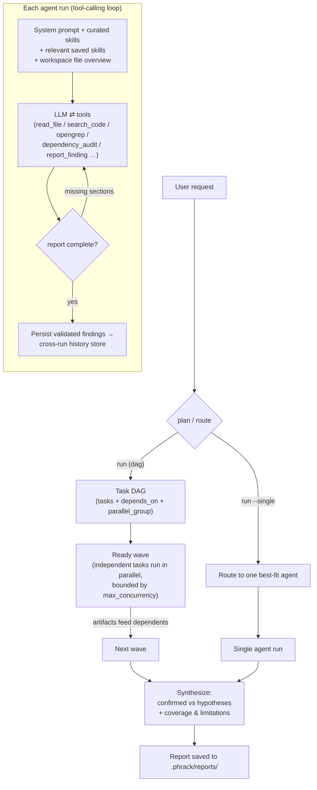

<!-- PHRAK Agent README -->

```
 ██████╗ ██╗  ██╗██████╗  █████╗ ██╗  ██╗
 ██╔══██╗██║  ██║██╔══██╗██╔══██╗██║ ██╔╝
 ██████╔╝███████║██████╔╝███████║█████╔╝
 ██╔═══╝ ██╔══██║██╔══██╗██╔══██║██╔═██╗
 ██║     ██║  ██║██║  ██║██║  ██║██║  ██╗
 ╚═╝     ╚═╝  ╚═╝╚═╝  ╚═╝╚═╝  ╚═╝╚═╝  ╚═╝
```

# PHRAK Agent — local AppSec agent swarm + codebase Q&A

A **local, multi-agent application-security toolkit**. Specialist agents (code
review, threat modeling, and security test-case generation) coordinated by a DAG
orchestrator, grounded in your actual code via a workspace RAG index and
read-only file tools. Clone a repo straight into a workspace to
analyze it. Runs **fully offline on a local Ollama model** by default, or on
**Claude via the Anthropic API** if you opt in at setup. **PHRAK does not use
Nuclei** (or Semgrep/CodeQL/Joern — Opengrep is the sole static analyzer).

Everything a run produces stays on your machine, inside a per-workspace
`.phrack/` directory (like `.claude`).

## Agents

| Agent | Role |
|-------|------|
| `code_review` | Finds vulnerabilities in source (OWASP/CWE) with `file:line` findings, exploitability reasoning, and fixes. Uses **Opengrep in taint mode** (source→sink dataflow traces for SQLi, cmd-injection, path traversal, SSRF, deserialization) as its confirmed-lead source, **Opengrep pattern scan** + **secret scanning** as unconfirmed leads, then verifies each in source, and records validated structured findings. Also has **semantic `rag_search`** for finding sibling instances of a bug pattern. |
| `threat_model` | STRIDE/PASTA threat model: components, trust boundaries, data flows, per-threat table, and prioritized attack paths, tied to real components in the code. |
| `test_case` | Reads the source (and the `code_review` findings + `threat_model` threats fed forward) and turns them into a **prioritized list of concrete security test cases** — each with an ID, target, steps, and an expected result — for you to work through manually. **PHRAK does not run the tests**; it produces the checklist. |
| `verify` *(opt-in)* | Takes each confirmed data-flow finding and runs a minimal PoC **inside a locked-down container** to demonstrate exploitability: `--network none`, read-only rootfs, non-root, dropped caps, memory/pids capped, wall-clock timeout. When a PoC lands, the finding's runtime status is promoted. Off by default (`enable_verify: false`) — running attacker payloads is a policy decision. |

The **orchestrator** plans a dependency graph of agent tasks, runs independent
ones in parallel, feeds each task's findings forward, and synthesizes one
consolidated report (confirmed vs. hypotheses, with coverage & limitations).

## Install

```bash
python -m venv venv && source venv/bin/activate
pip install -e .                       # installs the `phrak` command
# then install Ollama (https://ollama.com) and pull a model:
ollama pull qwen2.5-coder:7b
```

(Or, without installing: `pip install -r requirements.txt` and use `python cli.py …`.)

Requires [Ollama](https://ollama.com) with a tool-capable model (default
`qwen2.5-coder:7b`) — unless you choose the Anthropic provider, which needs only
an API key. Optionally install [Opengrep](https://opengrep.dev) for
static-analysis leads (PHRAK degrades gracefully without it).

## Configure — `phrak config`

```bash
phrak config
```

An interactive wizard (**no AI involved**) asking for your default workspace,
model provider, model settings, and embeddings backend. It writes
`<workspace>/.phrack/config.yaml`.
Launching PHRAK with no config runs the wizard automatically; re-run mid-session
with `/config`. Inspect the resolved config any time with `phrak config --show`
(secret-looking values are redacted).

### Model provider — Ollama or Claude

The wizard's first choice is where the model runs:

| Provider | What it means |
|----------|---------------|
| `ollama` *(default)* | Fully local. Nothing leaves the machine. Asks for model, base URL, and temperature. |
| `anthropic` | Claude via the Anthropic API. Asks for the model (default `claude-opus-5`, or `claude-sonnet-5` / `claude-haiku-4-5`), a max-output-token cap, and your API key. **Prompts — including the code excerpts the agents read — are sent to Anthropic.** |

**The API key is stored in `<workspace>/.phrack/credentials`**, mode `0600` —
never in `config.yaml` (which `config --show` prints and the RAG indexer reads).
At startup PHRAK exports it as the process-wide `ANTHROPIC_API_KEY` environment
variable, which is where the SDK picks it up, so nothing else has to handle the
key. A key stored for the workspace **takes precedence** over one already
exported in your shell — it's this workspace's explicit configuration. If the
provider is `anthropic` and no key is found anywhere, PHRAK says so at startup
instead of failing on the first model call.

Re-run `phrak config` to rotate the key (press Enter at the prompt to keep the
stored one), or edit/delete `.phrack/credentials` directly. `.phrack/` is
already gitignored.

Per-agent overrides work across providers — e.g. a local model for
`code_review` and Claude for `threat_model`:

```yaml
agent_models:
  threat_model:
    provider: anthropic
    model: claude-opus-5
```

Embeddings for `/ask` are **always local** (Anthropic has no embeddings API);
with the `anthropic` provider, set `rag.embeddings.base_url` if your Ollama
server isn't at `http://localhost:11434`.

### The `.phrack/` directory

All per-workspace state lives in a single `.phrack/` dir at the workspace root:

```
<workspace>/.phrack/
├── config.yaml   # this workspace's configuration
├── credentials   # provider API keys (mode 0600) — only if you use one
├── rag/          # code-index vector store (Chroma)
├── skills/       # reusable skills you add from the CLI/REPL
├── findings/     # persistent finding history (cross-run dedup + triage)
├── taint/        # persistent taint-path history
├── reports/      # saved assessment reports
├── clones/       # repos brought in with `phrak clone`
├── scope.yaml    # optional declarative scope/target policy
└── history       # chat REPL history
```

`.phrack/` is git-ignored. Point at another project with `-w /path/to/project`
and it uses that project's own `.phrack/`. Anything added with `--global`
(skills) lives in your user-level `~/.phrack/` and applies to
every workspace. (Legacy top-level `config.yaml` + `data/` layouts are still
auto-detected.)

### Config keys

The wizard writes everything you normally need, but `config.yaml` is plain YAML
you can edit. See [`config.example.yaml`](config.example.yaml) for the fully
commented file; the knobs worth knowing:

| Key | Default | What it controls |
|-----|---------|------------------|
| `llm.provider` / `llm.model` | `ollama` / `qwen2.5-coder:7b` | Where the model runs and which one |
| `llm.num_ctx` / `llm.max_tokens` | `8192` / `16000` | Ollama context window / Anthropic output cap |
| `rag.*` | see example | Index location, `recall_k`, `chunk_lines`/`chunk_overlap`, `max_file_kb`, embeddings backend |
| `orchestrator.mode` | `dag` | `dag` (graph + parallel fan-out) or `linear` |
| `orchestrator.max_concurrency` | `3` | Bounded parallel agents per wave |
| `orchestrator.continue_on_failure` | `true` | Isolate a failed task instead of aborting the run |
| `analyzers.opengrep` / `analyzers.dependency_audit` | `true` | Turn either deterministic analyzer off |
| `max_steps` / `max_rounds` | `40` / `4` | Per-round tool-call budget / completion nudges |
| `keep_reports` | `50` | Prune to the newest N reports (`0` = keep all) |
| `enable_git_clone` | `false` | Expose the guarded `git_clone` **tool** to `code_review` (see [Safety posture](#safety-posture)) |
| `agent_models` | `{}` | Per-agent overrides of any `llm:` field, across providers |

## Quick start

```bash
phrak                              # conversational chat (like `claude`)
phrak -w /path/to/target           # chat about a specific codebase
phrak run "assess this app for security issues" -w ./target   # full swarm + report
phrak run --single "review server.py" -w ./target             # route to one agent
phrak clone https://github.com/org/webapp -w ./ws  # clone a repo into the workspace to analyze
phrak agent code_review "review for injection bugs" -w ./target
phrak ask "how are sessions authenticated?" -w ./target       # RAG over the code
phrak ask --reindex "..." -w ./target  # rebuild the code index before asking
phrak agents                           # list agents (and the model each uses)
phrak findings -w ./target             # every finding recorded so far
phrak findings --severity high --resurfaced -w ./target   # filter the backlog
phrak findings FND-284b4aac0d -w ./target                 # one finding in full
phrak --json findings -w ./target      # the whole store as JSON, for CI
```

Global flags work on every subcommand: `-w/--workspace`, `-c/--config`,
`--quiet`, `--json`, `--no-color`, `--version`. (`phrak setup` is an
alias for `config`, `phrak interactive` for `chat`, and `-1` is short for
`run --single`.)

## Chat mode

Running `phrak` with no subcommand drops you into a conversational REPL: plain
text is a normal turn (PHRAK reads code and answers, keeping thread context), and
everything else is a slash command. `Tab` autocompletes them, `↑/↓` filters your
history by prefix, and unknown commands get a "did you mean" hint.

Anywhere in a message, `@path/to/file` inlines that file from the workspace into
the turn. Each reference is echoed back before the model runs (`attached
@app.py (1,204 B)`), so a typo'd path or a refused traversal is visible
immediately; files outside the workspace are never inlined.

| Command | What it does |
|---------|--------------|
| `/ask <text> [--reindex]` | Answer a question grounded in the codebase (RAG) |
| `/run <text>` | Full multi-agent assessment + saved report |
| `/route <text>` | Auto-route to the single best-fit agent |
| `/code_review`, `/threat_model`, `/test_case` `<text>` | Run one agent directly |
| `/agents [--verbose]` | List agents (with `--verbose`, their tools too) |
| `/findings [filters]` | List recorded findings (see [Triage](#triage-findings)) |
| `/finding <id>` | One finding in full: evidence, taint paths, history, notes |
| `/triage <id> <status> [note]` | Record your verdict on a finding |
| `/note <id> <text>` | Attach a reviewer note |
| `/clear` | Forget the conversation so far (fresh thread) |
| `/model [name]` | Show or switch the chat model for this session |
| `/cost` | Tokens used and estimated spend this session |
| `/verbose` | Toggle full tool output vs. one-line summaries |
| `/clone <url> [dest] [--index]` | Shallow-clone a repo to analyze |
| `/config [--show]` | Re-run the setup wizard (or print the redacted config) |
| `/help`, `/quit` | Grouped command list; exit |

Every `/run`, `/route`, and single-agent invocation saves and indexes its report
exactly like the equivalent CLI command.

## Triage findings

Agents write every finding into a durable, fingerprint-keyed store under
`.phrack/findings/` — so a finding keeps its identity across runs, and your
verdict on it survives the next scan. `/findings` and `phrak findings` are the
read/triage side of that store:

```bash
phrak findings                                  # the whole backlog, newest first
phrak findings --severity high --status new     # filter by severity / status
phrak findings --resurfaced                     # evidence changed since your verdict
phrak findings FND-284b4aac0d                   # full detail + status history + notes
phrak --json findings                           # machine-readable, for a CI gate
```

In chat, `/triage <id> <status> [note]` records a **human** verdict — one of
`new`, `confirmed`, `unconfirmed`, `false_positive`, `accepted_risk`, `fixed`.
Human triage is the authority of last resort: it can move a finding anywhere,
it's kept on a separate track from the agent's own status (so you can always see
both), and it is preserved when a later run re-observes the same finding.

If a re-run turns up materially stronger evidence for something you'd dismissed
— confidence jumped, severity changed, or a supporting taint path newly appeared
— the record is flagged **⟲ re-surfaced** for another look. `--resurfaced`
lists exactly those, and your next `/triage` clears the flag.

An `<id>` can be the full finding id, its fingerprint, or a unique prefix of
either.

## Bring in a codebase (`phrak clone`)

Analyze a remote repo without cloning it by hand — `phrak clone` (no AI) shallow-
clones it into a sandboxed area under the workspace and can index it in one step:

```bash
phrak clone https://github.com/org/webapp -w ./ws      # -> ./ws/clones/webapp
phrak clone git@github.com:org/webapp.git --index      # clone + build the RAG index
```

It clones `--depth 1 --single-branch` with **git hooks disabled** and submodules
skipped by default (`--recurse` to include them); **HTTPS/SSH URLs only** —
`file://`, local paths, and URLs carrying inline credentials are refused (so no
secret is ever written to a logged URL; use git's own SSH keys / credential
helper). The clone is size-capped and confined to `<workspace>/clones`. Cloned
code is treated like any other workspace target — the same read-only sandbox
applies.

## How orchestration works

`phrak run` plans a **DAG of agent tasks** and executes it with bounded parallel
fan-out: independent tasks run at the same time, dependent tasks wait for and
receive their prerequisites' output.



**Step by step:**
1. **Plan or route.** In `dag` mode (default) `phrak run` asks the LLM for a task
   graph — each task assigned to an agent, with `depends_on` and a
   `parallel_group` — and falls back to a linear DAG if planning fails.
   `orchestrator.mode: linear` keeps the classic ordered pipeline.
   `phrak run --single` routes to the single best-fit agent (LLM, then keyword
   heuristic) and skips synthesis.
2. **Execute the DAG.** The orchestrator runs each ready wave concurrently
   (bounded by `orchestrator.max_concurrency`, default 3). A failed task is
   **isolated**: its dependents are skipped, independent tasks keep running.
   Run-scoped state (findings, tool ledger) is context-isolated so parallel
   agents never clobber each other.
3. **Each agent** runs a tool-calling loop (bounded by `max_steps`) with its
   curated skills applied (front-loaded for `code_review`, or exposed as an
   on-demand index for the skill-heavy `threat_model` / `test_case`), the most
   relevant saved skills
   injected, and a real file overview of the workspace. If the report is missing
   required sections it's nudged to continue (up to `max_rounds`); if it stalls
   asking you to paste code, PHRAK reads the files itself. Progress is streamed to
   the terminal (see [Live activity output](#live-activity-output)).
4. **Findings feed forward** to dependent tasks (e.g. `code_review` +
   `threat_model` → `test_case`) and are **persisted** to the cross-run history
   store.
5. **Synthesis.** The orchestrator merges outputs into one report that
   **separates confirmed findings from hypotheses, preserves disagreement**
   between agents, and adds a coverage & limitations section (including any failed
   or skipped task), saved to `.phrack/reports/`.

### Surviving weaker local models

Small local models often *print* a tool call as JSON (or inside `<tool_call>`
tags) instead of emitting a structured one, which would otherwise make the agent
loop silently do nothing. `appsec/middleware.py` intercepts that: when a reply
carries no real tool calls but its content contains a well-formed call naming a
bound tool, it's converted into a genuine tool call and executed. This is why
PHRAK works on models like `qwen2.5-coder:7b` without per-agent workarounds.

## Static analyzer: Opengrep

`code_review` runs **Opengrep** as its deterministic lead source, then verifies
every hit by reading the code:

- **Opengrep** (`opengrep_scan`, `scan_secrets`) — fast pattern-based rules across
  many languages. [Opengrep](https://opengrep.dev) is the open-source (LGPL) fork
  of Semgrep OSS: the same `scan` subcommand and JSON output, but with no telemetry
  and no login. `opengrep_scan` returns `file:line [severity] rule -> message`;
  `scan_secrets` runs a secrets ruleset for hardcoded credentials/keys.

Opengrep is PHRAK's **sole** static analyzer — the earlier Semgrep/CodeQL/Joern
setup (and the bespoke Python taint engine before it) has been removed. The tool
is **optional and degrades gracefully**: if the binary isn't on PATH it returns an
install hint instead of failing the run. Findings are **leads**, not confirmed
vulnerabilities — the agent confirms each by reading the surrounding code.

### Installing Opengrep

```bash
# Linux/macOS — official installer puts `opengrep` on PATH:
curl -fsSL https://raw.githubusercontent.com/opengrep/opengrep/main/install.sh | bash
opengrep --version
```

PHRAK resolves the binary from `$PHRAK_OPENGREP_BIN` if set, otherwise `opengrep`
on PATH. Rules come from `--config`: `auto` (default), a registry id
(e.g. `p/owasp-top-ten`), or a **path to a local rules file/directory** — point at
a local ruleset for fully-offline scans.

### Normalized findings, dependency audit & false-sanitizer checks

Analyzer output isn't left as opaque text. Each analyzer is an **`AnalyzerAdapter`**
(`appsec/analyzers/`) that normalizes its results into the same structured
`SecurityFinding` objects an agent reports by hand, so they run through one
`validate → ground → dedupe` pipeline and render together:

- **`analyzer_scan`** — runs Opengrep and records each hit as a workspace-grounded,
  `unconfirmed` finding (a lead to verify), deduped with anything you later confirm.
- **`dependency_audit`** — audits dependency manifests for **known-vulnerable
  versions** via `pip-audit` / `npm audit` / `govulncheck` / `cargo audit` (per
  ecosystem, each optional), each normalized into a `vulnerable-dependency` finding
  with advisory id, severity, CWE, and fix version. (This is deeper than
  `analyze_dependencies`, which only dumps manifests.)
- **`check_sanitizer`** — a context-sensitive effectiveness table so the reviewer
  doesn't dismiss a bug on a **false-sanitizer assumption**: HTML-escape ≠ SQL-safe,
  `urlparse` ≠ SSRF-safe, `shlex.quote` is fragile with `shell=True`, a prefix check
  *before* canonicalization is bypassable, and authentication ≠ authorization.

## Security test cases (`test_case`)

`test_case` runs last in a full assessment. It reads the source together with the
findings fed forward from `code_review` and the threats from `threat_model`, and
turns them into a **prioritized list of concrete security test cases** for you to
work through by hand. Each test case is written in a standard, reviewable shape —
an ID (`TC-001`, …), a title, the finding/threat it verifies, the exact target
(endpoint / parameter / `file:line`), preconditions, numbered steps with a real
payload, and the **expected result** that proves the issue present-or-absent — and
the set is ordered by risk with a traceability table back to each finding/threat.

Its curated skills cover deriving test cases from findings and threats, the
standard test-case shape, abuse-case enumeration beyond the confirmed findings,
and risk-based prioritization.

**A checklist, not an executor — PHRAK never runs the tests.** The agent is
read-only (no HTTP or script-execution tool) and sends **no traffic to any
target**. It hands you the plan to run yourself in your own authorised
environment.

## Structured findings model

`appsec/models/findings.py` provides a typed `SecurityFinding` (with
`FindingEvidence` and `TaintPathReference`/`TaintNode`/`TaintStep`) used to
represent findings with evidence, CWE/OWASP tags, confidence, status, and
validated taint paths. It supports:
- **Stable fingerprints** so the same vuln is recognized across runs (history /
  dedup).
- **Validation** — confidence bounds, enums, workspace-grounded evidence (paths
  inside the workspace, valid line numbers, snippet ≈ source), and the rule that
  a data-flow finding cannot be `confirmed` without a supporting taint path.
- **Separate status tracks** — `agent` / `runtime` / `human`, folded into one
  `effective_status` with **human precedence** (human > runtime > agent), so who
  decided what stays auditable.
- **Serialization** + **Markdown rendering** + **deduplication**.

`report_finding` REJECTS structurally-invalid input and **downgrades** ungrounded
evidence to `unconfirmed` (it never silently upgrades a model claim).

## Findings history & scope

Findings and taint paths don't vanish when a run ends — they're persisted per
workspace so PHRAK can answer "is this new or known?" and keep triage decisions:

- **Persistent history** — every run upserts into `.phrack/findings/` and
  `.phrack/taint/` (JSONL), keyed by fingerprint, tracking first/last seen, a
  per-run log, status changes, and reviewer notes. A human verdict survives
  re-runs; a materially-changed re-observation is flagged `⟲ re-surfaced`.
- **Triage tracks** — `runtime` and `human` verdicts are recorded separately from
  the reporting agent's claim, so a status change stays attributable to whoever
  made it. The store is written by every run; there is no browse command for it
  yet, so read `.phrack/findings/findings.jsonl` directly.

- **Scope policy** — an optional `<workspace>/.phrack/scope.yaml` makes "what am I
  allowed to touch" declarative: `allowed_hosts` / `allowed_ports` / path prefixes
  and a `rate_limit_per_min`. It can only **narrow** what's already permitted — the
  loopback-only floor is always enforced first and never weakened. See
  [`scope.example.yaml`](scope.example.yaml).

- **Public log** — `.phrack/` never leaves your machine, so real findings worth
  publishing get curated by hand into [`FINDINGS.md`](FINDINGS.md): what PHRAK
  found, in what, and what happened after disclosure (plus a *Not findings*
  table for leads that triage killed).

### Sample structured finding (Markdown render)

```
### SQL injection in /user  `FND-ab12cd34ef`

Severity: High
Confidence: 0.91
Status: Confirmed
CWE: CWE-89
OWASP: A03:2021-Injection

Source:
- app/routes.py:44 — request.args['id']

Sink:
- app/db.py:91 — cursor.execute(q)

Taint path:
1. app/routes.py:44 — assignment
2. app/db.py:91 — call

Sanitizers:
- None observed

Evidence:
- app/routes.py:40-48 — untrusted query parameter
- app/db.py:84-96 — string-formatted SQL passed to execute()
```

## Skills

- **Curated skills** ship under `appsec/skills/<agent>/*.md` and encode each
  specialist's baseline methodology (threat_model: architecture · data-flow ·
  PASTA · threat-details · executive-summary; code_review: OWASP A01–A10;
  test_case: deriving-test-cases · test-case-design · abuse-case-enumeration ·
  prioritization). `code_review` has every curated skill inlined into its prompt
  and applies them all; skill-heavy agents (`threat_model`, `test_case`) instead
  get a one-line skill index and pull each full procedure on demand via
  `load_skill`, keeping the prompt within the model's context window.
- **Saved skills** live under `.phrack/skills/*.md` (per-workspace) or
  `~/.phrak/skills/*.md` (global, applies to every workspace; a workspace entry
  overrides a global one of the same name). PHRAK does not auto-author skills —
  drop your own markdown files into either directory. The most relevant ones are
  surfaced into later prompts by lexical relevance.

## Usability & customization

Quality-of-life features for daily use (none affect the security posture):

- **Scripting:** `--quiet` / `--json` output for scripting.
- **Config & color:** `--no-color`; `phrak config --show` (redacted).
- **Discoverability:** grouped `/help`, `/agents --verbose` (agents + their
  tools), `--version`, typo "did you mean" hints.
- **Run control:** clean Ctrl-C cancel; readline `↑/↓` filters your prompt
  history.

## Codebase Q&A (`/ask`)

`phrak ask "<question>"` retrieves relevant chunks from a local Chroma index over
the workspace and answers with `path:start-end` citations. The index covers
source + docs and **also indexes the workspace's own `.phrack/` reports and
saved skills** (so you can ask "what did the last threat model flag?"); only
the vector store itself (`.phrack/rag/`) is skipped. Tune under `rag:` in config.

Every finished run writes its report to `.phrack/reports/` and folds it straight
into `.phrack/rag/` — a single-agent run (`phrak agent <name> …`, `/<name>` in
chat) saves `report-<ts>-<agent>.md`, and a pipeline run saves its consolidated
`report-<ts>.md`. Because the agent appends its **structured findings** (id,
severity, CWE, evidence `file:line`, disproof condition) to its own output, you
can ask about a vulnerability the moment the run ends rather than waiting for
`/ask` to sync. Both kinds share the `report-*.md` namespace, so
`keep_reports` prunes them together.

Chunking is line-window based (`rag.chunk_lines` / `rag.chunk_overlap`), retrieval
is dense vector search over the local embeddings backend (`default` local ONNX or
`ollama`), and re-indexing is incremental (only changed files re-embed). Tune the
chunk size, `recall_k`, included extensions, and excluded dirs under `rag:` in
config.

## Live activity output

During any agent run PHRAK prints tool calls (`⚙ tool(args)` / `↳ tool: result`)
and each external syscall a tool makes (`⟫ exec: <command>` then `✓/✗ …`) tagged
with the running agent — so you can see if and when a subprocess or network call
happens. Between tool calls it also streams progress notes on the same channel:
`… <agent>: analyzing the workspace…`, a `✎` preview of the model's narration as
it writes, `… completion round N/M` while it fills in missing report sections,
`… recorded N structured finding(s)`, and `… compiling the final report` — so a
long run (e.g. `threat_model`) visibly shows activity instead of looking stuck.
Output stays clean when piped (no ANSI, no spinner artifacts).

## Safety posture

- `code_review`, `threat_model`, and `test_case` are all **read-only** — they
  read source and write reports, and have **no HTTP or script-execution tool**
  (the only way an agent touches the network is the opt-in `git_clone` tool
  below, off by default).
- `test_case` produces a test *plan*, not an executor: it sends **no traffic to
  any target**. Running the test cases is your own manual step, in an environment
  you're authorised to test.
- `phrak clone` reaches only the git host you name, shallow, with hooks disabled.
- **No agent can reach the network unless you opt in.** `enable_git_clone: true`
  is the single exception: it adds a guarded `git_clone` **tool** to
  `code_review` (to pull a dependency's source in-tree for reading), under the
  same guardrails as `phrak clone` — HTTPS/SSH only, shallow, hooks disabled,
  size-capped, confined to `<workspace>/clones`. It is **off by default**.
- **PHRAK stays local-first:** on the default `ollama` provider everything runs
  on your box, and every outbound path is explicit and configured — nothing
  leaves silently. Those paths are: `phrak clone` (and the opt-in `git_clone`
  tool), pointing the Ollama `base_url` at a remote endpoint, and **choosing the
  `anthropic` provider**,
  which sends prompts (with the code excerpts the agents read) to the Anthropic
  API. The provider is shown in the boot banner (`model anthropic:claude-opus-5`)
  so you can always see which one a run used.
- **API keys never enter the config or the index:** they live only in
  `.phrack/credentials` (mode `0600`, no indexed file extension), are redacted
  from `config --show`, and are passed to the SDK via an environment variable
  rather than embedded in prompts or reports.
- File tools are sandboxed to the workspace; subprocess calls (analyzers) never
  use `shell=True` with model input.
- Agents always pause for `ask_user` / `request_permission`; there is no mode
  that auto-answers or auto-grants on the human's behalf.
- **PHRAK never scans or attacks remote hosts. It does not use Nuclei.**

## Limitations (read these)

- LLM output quality tracks the local model you choose; **LLM confidence is not a
  probability of exploitability.**
- RAG retrieval is **not** proof of reachability.
- Test cases are **generated, not run** — PHRAK never executes them, so each is a
  hypothesis to verify until you work through it yourself against a system you're
  authorised to test.
- **Human review remains required.**

## Tests

```bash
pip install pytest
pytest -m "not integration"   # fast unit tests (no network/LLM; external CLIs mocked)
pytest                        # full suite (integration tests need Flask)
```

See [`TEST_PLAN.md`](TEST_PLAN.md) for the full pre-publish checklist.

## Roadmap

PHRAK was built incrementally on one architecture. All landed work:

- **Foundations** — local-first `.phrack/` layout, Ollama provider, live
  activity logging, curated + user-added skills.
- **Structured findings** — validated, workspace-grounded `SecurityFinding`
  model with stable fingerprints, taint-path references, and dedup.
- **Security test cases** — a read-only test-case agent that turns findings and
  threats into a prioritized, traceable manual test plan (no live testing / no
  target traffic).
- **Opengrep** as the sole static analyzer + analyzer→finding normalization,
  dependency audit (pip/npm/go/cargo), and a context-sensitive sanitizer table.
- **History & scope** — persistent cross-run finding/taint history with separate
  agent/runtime/human status tracks, and a declarative scope policy
  (`.phrack/scope.yaml`).
- **DAG orchestration** — dependency-graph planning with bounded parallel
  fan-out and partial-failure isolation, and a disagreement-preserving
  synthesizer.
- **Usability & extensibility** — `--quiet`/`--json`/`--no-color`, grouped
  `/help`, `/agents --verbose`, and no-AI `phrak clone`.

## Project layout

```
appsec/
  cli.py            argparse entry point (`phrak`) + the chat REPL loop
  app.py            bootstrap: config -> llm, skills, rag, orchestrator, registry
  base_agent.py     agent loop + registry + run-to-completion + finding persistence
  orchestrator.py   planner/router + DAG execution (parallel fan-out) + synthesis
  chat.py           conversational session (multi-turn, tool use, thread memory)
  repl.py           chat REPL helpers (readline autocomplete/history, grouped /help)
  llm.py            chat-model factory (ollama | anthropic) + model registry
  middleware.py     rescues "verbalized" tool calls from weaker local models
  runtime.py        process/run-scoped context (config, active agent, findings,
                    tool ledger — context-vars, so parallel agents stay isolated)
  config.py         config + setup wizard + .phrack path resolution + config --show
  credentials.py    provider API keys (.phrack/credentials -> env var at startup)
  rag.py            workspace code index (Chroma) powering /ask
  store.py          persistent finding/taint history (.phrack/findings, .phrack/taint)
  scope.py          declarative scope/target policy (.phrack/scope.yaml)
  clone.py          guarded shallow git clone
  session_cmds.py   tool listing/detail helpers (used by /agents --verbose)
  skill_store.py    saved-skills store (workspace + ~/.phrak global)
  skill_library.py  curated skills (appsec/skills/<agent>/*.md)
  file_assist.py    workspace overview + read-files-on-demand
  banner.py         startup banner + ANSI styling (NO_COLOR / non-TTY aware)
  ui.py             spinners, live activity log, markdown render, agent prompts
  models/           structured findings + taint models
  agents/           code_review, threat_model, test_case
  analyzers/        AnalyzerAdapter base + opengrep, dependencies, sanitizers
  tools/            common (sandbox/subprocess/loopback+SSRF guard), filesystem,
                    analysis, opengrep_tools, analyzer_tools, findings_tool,
                    clone_tool, interaction, skills_tool
  skills/           curated skills: threat_model/*.md, code_review/*.md,
                    test_case/*.md
cli.py              thin shim so `python cli.py …` still works
tests/              pytest bench (unit + marker-gated integration)
```

## Security

- **Found a vulnerability in PHRAK itself?** See [`SECURITY.md`](SECURITY.md) —
  report it privately, don't open a public issue.
- **Findings PHRAK has produced** are logged in [`FINDINGS.md`](FINDINGS.md).

## Contributing

See [`CONTRIBUTING.md`](CONTRIBUTING.md) — dev setup, the `black` / `ruff` style
rules, the mandatory module-header docstring, and the architecture invariants a
PR must not break (read-only agents, no network without opt-in, Opengrep as the
sole static analyzer). False positives and missed findings belong in a normal
issue; vulnerabilities in PHRAK itself go to [`SECURITY.md`](SECURITY.md).

## License

MIT — see [`LICENSE`](LICENSE).
