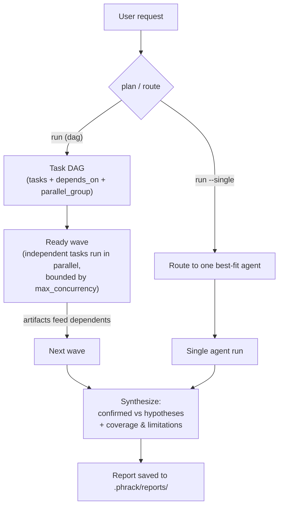

<!-- PHRAK Agent README -->

```
 ██████╗ ██╗  ██╗██████╗  █████╗ ██╗  ██╗
 ██╔══██╗██║  ██║██╔══██╗██╔══██╗██║ ██╔╝
 ██████╔╝███████║██████╔╝███████║█████╔╝
 ██╔═══╝ ██╔══██║██╔══██╗██╔══██║██╔═██╗
 ██║     ██║  ██║██║  ██║██║  ██║██║  ██╗
 ╚═╝     ╚═╝  ╚═╝╚═╝  ╚═╝╚═╝  ╚═╝╚═╝  ╚═╝
```

# PHRAK Agent — a whitebox penetration testing assistant

**PHRAK works a whitebox engagement from the source side, end to end: recon of
the codebase, threat modeling, code review, findings triage, a manual test plan,
and the final report.** It reads the application; it never touches one.

That boundary is the whole design. PHRAK has **no HTTP client, no proxy, no
scanner, and no exploit runner** — it sends **zero packets to any target**. What
it produces is the artifact a whitebox tester needs: a prioritized set of
findings grounded in `file:line` evidence, and a test plan **you** execute
against a system you are authorised to test.

```
     source code                        PHRAK                        you
  ┌───────────────┐        ┌──────────────────────────────┐    ┌────────────┐
  │ repo / clone  │──read─▶│ recon · threat model · review │───▶│ triage     │
  │ dependencies  │        │ taint analysis · test plan    │    │ execute    │
  │ config        │        │ findings backlog · report     │    │ the tests  │
  └───────────────┘        └──────────────────────────────┘    └────────────┘
                                        ╳
                            never talks to the running app
```

| PHRAK does | PHRAK does not |
|------------|----------------|
| Read source, config, and dependency manifests | Send a single request to a live target |
| Trace taint from source to sink (OpenGrep) | Run an exploit against a deployed app |
| Model threats and attack paths against real components | Spider, fuzz, or scan a host |
| Keep a durable findings backlog you triage | Decide for you whether a bug is real |
| Author a manual test plan and track your progress | **Execute** those tests |
| Assemble the whole engagement into one report | Replace the human tester |

The one exception is opt-in and still never reaches your target: the
[`verify` agent](#the-verify-agent-opt-in) can run a minimal proof-of-concept
against **the code, inside a locked-down container with no network**. It is off
by default.

Runs **fully offline on a local Ollama model** by default, or on **Claude via
the Anthropic API** if you opt in. **No Nuclei, no CodeQL/Joern** — OpenGrep is
the sole static analyzer. Everything a run produces stays on your machine in a
per-workspace `.phrack/` directory (like `.claude`).

## The workflow

A whitebox engagement, in the order you'd actually run it:

```bash
phrak clone https://github.com/org/app -w ./ws --index   # 1. bring the code in
phrak run "assess this app" -w ./ws                      # 2. model + review + tests
phrak findings -w ./ws                                   # 3. triage what came back
phrak testcases -w ./ws                                  # 4. work the test plan
phrak report -w ./ws                                     # 5. one deliverable
```

Steps 3 and 4 are yours, and **nothing in them involves a model**: you confirm
or dismiss findings, add ones you found yourself, and mark test cases off as you
execute them. Step 5 assembles everything into a single report.

## Agents

| Agent | Role |
|-------|------|
| `code_review` | Finds vulnerabilities in source (OWASP/CWE) with `file:line` findings, exploitability reasoning, and fixes. Uses **OpenGrep taint mode** (source→sink traces) as confirmed leads, **OpenGrep pattern + secret scans** as unconfirmed leads, verifies each in source, and records structured findings. Has semantic `rag_search` for sibling instances of a pattern. |
| `threat_model` | STRIDE/PASTA threat model: components, trust boundaries, data flows, a per-threat table, and prioritized attack paths, tied to real components in the code. |
| `test_case` | Turns the source (+ `code_review` findings and `threat_model` threats fed forward) into a **prioritized list of concrete security test cases** — each with a target, steps, and expected result. Recorded in a trackable [backlog](#test-cases). **PHRAK does not run the tests.** |
| `generate_report` | Assembles the engagement into one deliverable. Its body is **quoted verbatim** from the runs and stores; only the executive summary is model-written. See [The final report](#the-final-report-generate_report). |
| `verify` *(opt-in)* | Runs a minimal PoC for each confirmed data-flow finding **inside a locked-down container** to demonstrate exploitability, then promotes the finding's runtime status. Off by default (`enable_verify: false`). |

The **orchestrator** plans a dependency graph of agent tasks, runs independent
ones in parallel, feeds each task's findings forward, and synthesizes one report
(confirmed vs. hypotheses, with coverage & limitations). `generate_report` is
deliberately **not** schedulable by the planner — it is invoked by hand, once
the work it reports on exists.

## Install

```bash
python -m venv venv && source venv/bin/activate
pip install -e .                       # installs the `phrak` and `phrakagent` commands
# then install Ollama (https://ollama.com) and pull a model:
ollama pull qwen2.5-coder:7b
```

This installs two commands:

- **`phrakagent [DIR]`** — launch a chat session scoped to `DIR` (defaults to
  the current directory). `DIR` becomes the workspace: the root the file tools
  read, and where `.phrack/` is anchored. Trailing arguments pass through to the
  full CLI, e.g. `phrakagent /proj run "assess this app"`.
- **`phrak`** — the full CLI (`run` / `agent` / `ask` / `findings` / `config` /
  …), with `-w/--workspace` to point at a directory.

(Or, without installing: `pip install -r requirements.txt` and use
`python cli.py …`.)

Requires [Ollama](https://ollama.com) with a tool-capable model (default
`qwen2.5-coder:7b`) — unless you choose the Anthropic provider, which needs only
an API key. Optionally install [OpenGrep](https://opengrep.dev) for
static-analysis leads (PHRAK degrades gracefully without it).

## Configure — `phrak config`

```bash
phrak config
```

An interactive wizard (**no AI involved**) for your default workspace, model
provider, model settings, and embeddings backend. It writes
`<workspace>/.phrack/config.yaml`. Launching PHRAK with no config runs the
wizard automatically; re-run mid-session with `/config`. Inspect the resolved
config with `phrak config --show` (secret-looking values are redacted).

### Model provider — Ollama or Claude

| Provider | What it means |
|----------|---------------|
| `ollama` *(default)* | Fully local. Nothing leaves the machine. Asks for model, base URL, and temperature. |
| `anthropic` | Claude via the Anthropic API. Asks for the model (default `claude-opus-5`, or `claude-sonnet-5` / `claude-haiku-4-5`), a max-output-token cap, and your API key. **Prompts — including the code excerpts the agents read — are sent to Anthropic.** |

**The API key is stored in `<workspace>/.phrack/credentials`** (mode `0600`),
never in `config.yaml`. At startup PHRAK exports it as `ANTHROPIC_API_KEY`; a key
stored for the workspace takes precedence over one already in your shell. If the
provider is `anthropic` and no key is found, PHRAK says so at startup instead of
failing on the first model call. Re-run `phrak config` to rotate it (Enter keeps
the stored one), or edit/delete `.phrack/credentials` directly.

Per-agent overrides work across providers — e.g. a local model for `code_review`
and Claude for `threat_model`:

```yaml
agent_models:
  threat_model:
    provider: anthropic
    model: claude-opus-5
```

Embeddings for `/ask` are **always local** (Anthropic has no embeddings API);
with the `anthropic` provider, set `rag.embeddings.base_url` if your Ollama
server isn't at `http://localhost:11434`.

### The `.phrack/` directory

All per-workspace state lives in a single `.phrack/` dir at the workspace root:

```
<workspace>/.phrack/
├── config.yaml   # this workspace's configuration
├── credentials   # provider API keys (mode 0600) — only if you use one
├── rag/          # code-index vector store (Chroma)
├── skills/       # reusable skills you add from the CLI/REPL
├── findings/     # persistent finding history (cross-run dedup + triage)
├── testcases/    # the manual test-case backlog + your progress on it
├── taint/        # persistent taint-path history
├── reports/      # saved assessment reports
├── clones/       # repos brought in with `phrak clone`
├── scope.yaml    # optional declarative scope/target policy
└── history       # chat REPL history
```

`.phrack/` is git-ignored. Point at another project with `-w /path/to/project`
and it uses that project's own `.phrack/`. Anything added with `--global`
(skills) lives in `~/.phrack/` and applies to every workspace. (Legacy top-level
`config.yaml` + `data/` layouts are still auto-detected.)

### Config keys

The wizard writes everything you normally need, but `config.yaml` is plain YAML
you can edit. See [`config.example.yaml`](config.example.yaml) for the fully
commented file; the knobs worth knowing:

| Key | Default | What it controls |
|-----|---------|------------------|
| `llm.provider` / `llm.model` | `ollama` / `qwen2.5-coder:7b` | Where the model runs and which one |
| `llm.num_ctx` / `llm.max_tokens` | `16384` / `16000` | Ollama context window / Anthropic output cap |
| `rag.*` | see example | Index location, `recall_k`, `chunk_lines`/`chunk_overlap`, `max_file_kb`, embeddings backend |
| `orchestrator.mode` | `dag` | `dag` (graph + parallel fan-out) or `linear` |
| `orchestrator.max_concurrency` | `3` | Bounded parallel agents per wave |
| `orchestrator.continue_on_failure` | `true` | Isolate a failed task instead of aborting the run |
| `analyzers.opengrep` / `analyzers.dependency_audit` | `true` | Turn either deterministic analyzer off |
| `max_steps` / `max_rounds` | `40` / `4` | Per-round tool-call budget / completion nudges |
| `keep_reports` | `50` | Prune to the newest N reports (`0` = keep all) |
| `enable_git_clone` | `false` | Expose the guarded `git_clone` **tool** to `code_review` (see [Safety posture](#safety-posture)) |
| `enable_verify` | `false` | Register the opt-in `verify` agent (runs PoCs in a container) |
| `verify_runtime` / `verify_image` | `auto` / `python:3.12-slim` | Container runtime (`auto` → docker, then podman) and PoC image |
| `verify_network` | `none` | PoC container networking — `none`, or `bridge` if you deliberately need it |
| `verify_timeout_s` / `verify_memory_mb` / `verify_pids` | `30` / `512` / `128` | Per-PoC wall clock, memory, and process caps |
| `agent_models` | `{}` | Per-agent overrides of any `llm:` field, across providers |

The `verify_*` keys only matter when `enable_verify: true`; see
[The `verify` agent](#the-verify-agent-opt-in).

## Quick start

```bash
phrak                              # conversational chat (like `claude`)
phrak -w /path/to/target           # chat about a specific codebase
phrak run "assess this app for security issues" -w ./target   # full swarm + report
phrak run --single "review server.py" -w ./target             # route to one agent
phrak clone https://github.com/org/webapp -w ./ws  # clone a repo into the workspace to analyze
phrak agent code_review "review for injection bugs" -w ./target
phrak ask "how are sessions authenticated?" -w ./target       # RAG over the code
phrak index -w ./target                # build/refresh the code index (no AI)
phrak index --stats -w ./target        # what's indexed, what's pending
phrak agents                           # list agents (and the model each uses)
phrak findings -w ./target             # every finding recorded so far
phrak findings --severity high --resurfaced -w ./target   # filter the backlog
phrak findings FND-284b4aac0d -w ./target                 # one finding in full
phrak add-finding -w ./target          # record one you verified yourself (no AI)
phrak testcases -w ./target            # the manual test plan, as a checklist
phrak add-testcase -w ./target         # write a test case by hand (no AI)
phrak report -w ./target               # assemble the whole engagement
phrak --json findings -w ./target      # the whole store as JSON, for CI
```

Global flags work on every subcommand: `-w/--workspace`, `-c/--config`,
`--quiet`, `--json`, `--no-color`, `--version`. (`phrak setup` aliases `config`,
`phrak interactive` aliases `chat`, and `-1` is short for `run --single`.)

## Chat mode

Running `phrak` with no subcommand drops you into a conversational REPL: plain
text is a normal turn (PHRAK reads code and answers, keeping thread context), and
everything else is a slash command. `Tab` autocompletes, `↑/↓` filters history by
prefix, and unknown commands get a "did you mean" hint.

Anywhere in a message, `@path/to/file` inlines that file from the workspace into
the turn. Each reference is echoed back before the model runs (`attached
@app.py (1,204 B)`), so a typo'd path or a refused traversal is visible
immediately; files outside the workspace are never inlined.

| Command | What it does |
|---------|--------------|
| `/ask <text> [--reindex]` | Answer a question grounded in the codebase (RAG) |
| `/index [--rebuild\|--stats]` | Build or refresh the code index — no AI |
| `/run <text>` | Full multi-agent assessment + saved report |
| `/route <text>` | Auto-route to the single best-fit agent |
| `/code_review`, `/threat_model`, `/test_case` `<text>` | Run one agent directly |
| `/agents [--verbose]` | List agents (with `--verbose`, their tools too) |
| `/generate_report` | Assemble the whole engagement into one report |
| `/findings [filters]` | List recorded findings (see [Triage](#triage-findings)) |
| `/finding <id>` | One finding in full: evidence, taint paths, history, notes |
| `/finding-add` | Record a finding **you** verified — prompts, no AI |
| `/triage <id> <status> [note]` | Record your verdict on a finding |
| `/note <id> <text>` | Attach a reviewer note |
| `/testcases [filters]` | The test-case backlog as a checklist |
| `/testcase <id>` | One test case in full |
| `/testcase-add` | Write a test case by hand — prompts, no AI |
| `/testcase-status <id> <s>` | `new` / `in_progress` / `complete` (+ optional result) |
| `/testcase-link <id> <FND-…>` | Tie a test to the finding it verifies |
| `/testcase-note <id> <text>` | Record what happened when you ran it |
| `/clear` | Forget the conversation so far (fresh thread) |
| `/model [name]` | Show or switch the chat model for this session |
| `/cost` | Tokens used and estimated spend this session |
| `/verbose` | Toggle full tool output vs. one-line summaries |
| `/clone <url> [dest] [--index]` | Shallow-clone a repo to analyze |
| `/config [--show]` | Re-run the setup wizard (or print the redacted config) |
| `/help`, `/quit` | Grouped command list; exit |

Every `/run`, `/route`, and single-agent invocation saves and indexes its report
exactly like the equivalent CLI command.

## Triage findings

Agents write every finding into a durable, fingerprint-keyed store under
`.phrack/findings/` — so a finding keeps its identity across runs, and your
verdict on it survives the next scan. `/findings` and `phrak findings` are the
read/triage side of that store:

```bash
phrak findings                                  # the whole backlog, newest first
phrak findings --severity high --status new     # filter by severity / status
phrak findings --resurfaced                     # evidence changed since your verdict
phrak findings FND-284b4aac0d                   # full detail + status history + notes
phrak --json findings                           # machine-readable, for a CI gate
```

In chat, `/triage <id> <status> [note]` records a **human** verdict — one of
`new`, `confirmed`, `unconfirmed`, `false_positive`, `accepted_risk`, `fixed`.
Human triage is the authority of last resort: it can move a finding anywhere,
it's kept on a separate track from the agent's own status, and it is preserved
when a later run re-observes the same finding.

If a re-run turns up materially stronger evidence for something you'd dismissed
(confidence jumped, severity changed, or a supporting taint path newly appeared),
the record is flagged **⟲ re-surfaced**. `--resurfaced` lists exactly those, and
your next `/triage` clears the flag. An `<id>` can be the full finding id, its
fingerprint, or a unique prefix of either.

**Findings you found yourself.** `/finding-add` (or `phrak add-finding`) records
one you verified by hand — **no model is involved** — landing on the **human**
track as `confirmed`:

```bash
phrak add-finding --title "Auth bypass on /admin" --category "broken access control" \
  --severity critical --file app/views.py --line 88 --cwe CWE-862
```

The id is derived from the finding's own content (category + location + title),
so if an agent later reports the same issue the two converge onto **one** record
rather than duplicating — and your verdict is the one that sticks. If the path
doesn't resolve in the workspace you get a warning, not a downgrade.

## Test cases

The `test_case` agent authors a manual test plan; the backlog is where **you**
work it. Every test case is a tracked item with a generated `TC-…` id, a status,
an optional result, notes, and a link to the finding it verifies.

```bash
phrak testcases                        # the checklist
phrak testcases --status in_progress   # what you're mid-way through
phrak testcases --finding FND-9c41ba22e0   # tests covering one finding
phrak testcases --unlinked             # tests not tied to any finding
phrak testcases TC-4751bf44            # one test case in full
phrak --json testcases                 # for a tracker import
```

```
3 test case(s) — 1 complete, 1 in progress, 1 new:
☑ TC-4751bf44  [critical] complete     [fail]     SQLi via uid            verifies FND-c3deed9c78
◐ TC-a1b2c3d4  [high    ] in_progress             Auth bypass on /admin   verifies FND-9c41ba22e0
☐ TC-9f8e7d6c  [medium  ] new                     Rate limit on /login    verifies —
```

Working the list, in chat:

```
/testcase-status TC-4751bf44 complete fail     # 'fail' = the app was vulnerable
/testcase-note   TC-4751bf44 reproduced with a single quote in uid
/testcase-link   TC-9f8e7d6c FND-9c41ba22e0    # tie it to the finding it verifies
```

Statuses are `new`, `in_progress`, `complete`. Results are `pass`, `fail`,
`blocked`, `inconclusive` — **`fail` means the test found the app vulnerable**.
`/testcase-link` refuses an id that doesn't exist, so a typo surfaces immediately.
**Add your own** with `/testcase-add` (or `phrak add-testcase`), no model
involved:

```bash
phrak add-testcase --title "Rate limit on /login" --target "POST /login" \
  --steps "send 100 requests in 10s | observe throttling" \
  --expected "requests are rejected after N" --severity medium
```

**Re-running `test_case` never costs you progress** — a re-authored test keeps
its status, result, notes and link; only the instructions are refreshed
(identity is derived from title + target). **Every finding gets a test case:**
after a full `phrak run`, the orchestrator reconciles the backlog against the
findings store (`appsec/coverage.py`), links authored tests to the findings they
verify, and backfills a minimal verification test case for any finding —
confirmed or unconfirmed — that nothing else covers. The step is idempotent.

## The final report (`generate_report`)

`phrak report` (or `/generate_report`) assembles one deliverable:

| Section | Where it comes from |
|---------|---------------------|
| 1. Executive Summary | **Written by the model** — the only generated prose |
| 2. Threat Model | The latest `threat_model` report, quoted verbatim |
| 3. Code Review | The latest `code_review` report, quoted verbatim |
| 4. Findings | Rendered from `.phrack/findings/`, severity-ordered |
| 5. Test Cases | Rendered from `.phrack/testcases/`, with your progress |

```bash
phrak report                              # render to the terminal
phrak report "pre-release audit"          # add a scope note to the header
phrak report --out ./assessment.md        # write it to a file
```

**Only the executive summary is generated.** Everything else is quoted or
rendered from artifacts that already exist, because a model asked to "summarize
the code review" paraphrases — and a paraphrased finding drifts from the
`file:line` evidence the report rests on. A full `phrak run` leaves the material
this report needs: each specialist's own output is saved as its own
`report-<ts>-<agent>.md`. The report is honest about gaps — if `threat_model`
has never been run the section says so and names the command to fix it; if the
model is unreachable the summary is replaced by a factual stub while every
assembled section survives intact. `generate_report` is excluded from the
planner, so `phrak run` can never schedule it before the findings exist.

## Bring in a codebase (`phrak clone`)

`phrak clone` (no AI) shallow-clones a remote repo into a sandboxed area under
the workspace and can index it in one step:

```bash
phrak clone https://github.com/org/webapp -w ./ws      # -> ./ws/clones/webapp
phrak clone git@github.com:org/webapp.git --index      # clone + build the RAG index
```

It clones `--depth 1 --single-branch` with **git hooks disabled** and submodules
skipped by default (`--recurse` to include them); **HTTPS/SSH URLs only** —
`file://`, local paths, and URLs carrying inline credentials are refused. The
clone is size-capped and confined to `<workspace>/clones`. Cloned code gets the
same read-only sandbox as any other workspace target.

## How orchestration works

`phrak run` plans a **DAG of agent tasks** and executes it with bounded parallel
fan-out: independent tasks run at the same time, dependent tasks wait for and
receive their prerequisites' output.



1. **Plan or route.** In `dag` mode (default) `phrak run` asks the LLM for a task
   graph — each task assigned to an agent, with `depends_on` and a
   `parallel_group` — and falls back to a linear DAG if planning fails.
   `orchestrator.mode: linear` keeps the classic ordered pipeline. `run --single`
   routes to the single best-fit agent and skips synthesis.
2. **Execute the DAG.** Each ready wave runs concurrently (bounded by
   `max_concurrency`, default 3). A failed task is **isolated**: its dependents
   are skipped, independent tasks keep running. Run-scoped state is
   context-isolated so parallel agents never clobber each other.
3. **Each agent** runs a tool-calling loop (bounded by `max_steps`) with its
   curated skills, the most relevant saved skills injected, and a real file
   overview of the workspace. Missing report sections get a nudge to continue (up
   to `max_rounds`); if it stalls asking you to paste code, PHRAK reads the files
   itself. Progress is streamed (see [Live activity output](#live-activity-output)).
4. **Findings feed forward** to dependent tasks (e.g. `code_review` +
   `threat_model` → `test_case`) and are **persisted** to the cross-run history
   store. If the agents recorded nothing structured (a weak model that only wrote
   prose), the orchestrator salvages findings and test cases out of the report
   itself — see [Robustness on weak local models](#robustness-on-weak-local-models).
5. **Synthesis.** Outputs merge into one report that **separates confirmed
   findings from hypotheses, preserves disagreement** between agents, and adds a
   coverage & limitations section (including any failed or skipped task), saved to
   `.phrack/reports/`.
6. **Coverage reconciliation.** The orchestrator ties test cases to findings
   (`appsec/coverage.py`): each test case is linked to the finding it clearly
   verifies (unambiguous title-token overlap only), and every finding still
   without a linked test — including unconfirmed ones — gets a minimal
   verification test case. Idempotent, so a covered finding is never duplicated.

### Robustness on weak local models

Small local models often *print* a tool call (as JSON, or inside `<tool_call>`
tags) instead of emitting a structured one, and unreliably call the capture tools
even when they write a full report. PHRAK closes both gaps so it works on models
like `qwen2.5-coder:7b` without per-agent workarounds — all non-Anthropic-only
(Claude emits real tool calls):

- **Verbalized tool calls (`appsec/middleware.py`).** When a reply has no real
  tool calls but its content contains a well-formed call naming a bound tool, it's
  converted into a genuine call and executed. **This is also a prompt-injection
  surface** — a security agent reads hostile input by definition — so the
  extractor narrows what counts as intent: only fenced blocks / `<tool_call>` tags
  (raw JSON in prose is ignored), example-framing ("for example", "do not run") is
  skipped, and inline `` `code spans` `` / blockquoted lines never trigger a call.
  It stays a *compensating control for weak models*, not a security boundary — the
  real boundaries are the read-only tool set and the workspace sandbox.
  `tests/test_middleware_injection.py` pins each rule.
- **Guaranteed capture, three escalating layers.** Agents are prompted to record
  each item the moment they confirm it. If an agent finishes with a full report
  but an empty store, it gets one focused turn to transcribe the report into
  capture-tool calls. If the store is *still* empty, deterministic extraction
  (`appsec/extract.py`) parses the report text itself — no model, no tools — into
  the same validated objects, grounding each against the workspace (an item whose
  `file:line` can't be located is recorded `unconfirmed`). The orchestrator does
  the same salvage on the *consolidated* report, but only for a track the agents
  left empty this run. The extractor is conservative: only blocks carrying the
  attributes of a real finding/test case are recorded. `tests/test_extract.py`
  pins it against the shapes `qwen2.5-coder:7b` produces.

## Static analyzer: OpenGrep

`code_review` runs **OpenGrep** as its deterministic lead source, then verifies
every hit by reading the code:

- **`opengrep_taint_scan`** — OpenGrep in **taint mode** with PHRAK's bundled
  ruleset (`appsec/analyzers/rules/taint/`), tracing source→sink dataflow. These
  are the **confirmed leads**: a hit carries an actual path from untrusted input
  to a dangerous sink.
- **`opengrep_scan`** — fast pattern-based rules across many languages
  (`--config auto`). Returns `file:line [severity] rule -> message`. **Unconfirmed
  leads** to verify in source.
- **`scan_secrets`** — OpenGrep's secrets ruleset, for hardcoded credentials/keys.

**Bundled taint-rule coverage is deliberately narrow** — hand-written rules that
hold up, not breadth:

| Language | Rules |
|----------|-------|
| Python | SQL injection, command injection, path traversal, SSRF, unsafe deserialization |
| JavaScript / TypeScript | SQL injection, command injection, SSRF |

Anything outside that table gets no taint trace — pattern rules and the agent's
own source reading are the fallback, both producing `unconfirmed` findings. Since
a data-flow finding **cannot be marked `confirmed` without a supporting taint
path**, a SQLi in Ruby or Java surfaces as a lead and stays one. Point `--config`
at your own rules to extend this.

OpenGrep is PHRAK's **sole** static analyzer (the earlier CodeQL/Joern setup has
been removed). It's **optional and degrades gracefully**: if the binary isn't on
PATH it returns an install hint instead of failing the run.

```bash
# Linux/macOS — official installer puts `opengrep` on PATH:
curl -fsSL https://raw.githubusercontent.com/opengrep/opengrep/main/install.sh | bash
opengrep --version
```

PHRAK resolves the binary from `$PHRAK_OPENGREP_BIN` if set, otherwise `opengrep`
on PATH. Rules come from `--config`: `auto` (default), a registry id
(e.g. `p/owasp-top-ten`), or a **path to a local rules file/directory** for
fully-offline scans.

**Normalized output.** Each analyzer is an **`AnalyzerAdapter`**
(`appsec/analyzers/`) that normalizes results into the same structured
`SecurityFinding` an agent reports by hand, run through one
`validate → ground → dedupe` pipeline: `analyzer_scan` (OpenGrep hits as
workspace-grounded `unconfirmed` leads), `dependency_audit` (known-vulnerable
versions via `pip-audit` / `npm audit` / `govulncheck` / `cargo audit`, each
optional, normalized into a `vulnerable-dependency` finding with advisory id and
fix version), and `check_sanitizer` (a context-sensitive effectiveness table so
the reviewer doesn't dismiss a bug on a false-sanitizer assumption — HTML-escape
≠ SQL-safe, `urlparse` ≠ SSRF-safe, and so on).

## The `verify` agent (opt-in)

Every other agent is static and read-only. `verify` is the one that **executes
attacker input**, so it is off by default and has to be turned on deliberately:

```yaml
enable_verify: true          # .phrack/config.yaml
```

It only appears in the agent registry when that flag is set — otherwise the DAG
planner can't schedule it. It needs `docker` or `podman` on PATH; without one,
`run_poc` returns an install hint instead of falling back to the host.

**What it does.** It runs after `code_review`/`threat_model` and takes their
**confirmed data-flow findings** (SQLi, command injection, path traversal, unsafe
deserialization, SSRF against a controlled target), writes a short PoC for each,
and runs it in a container with `run_poc`. It may only confirm findings already
in the run's ledger; discovery is not its job. It records the verdict with
**`record_poc_result(finding_id, outcome, …)`**, which writes to the finding's
**runtime** status track:

| `outcome` | Effect on the finding |
|-----------|-----------------------|
| `confirmed` | Runtime track → `confirmed` (confidence raised) — a landed PoC is the strongest evidence there is |
| `false_positive` | Runtime track → `false_positive`; never re-marked confirmed |
| `inconclusive` | Status unchanged, a note is attached (needs a full app stack / out of scope) |

The runtime track folds into the finding's `effective_status` **above** the
agent's status but **below** a human triage decision (human > runtime > agent).

**The sandbox.** Every PoC runs via `docker run --rm` (or podman) with:

| Flag | Effect |
|------|--------|
| `--network none` | No network at all (`verify_network`; `bridge` only if you set it) |
| `--read-only` + `--tmpfs /tmp` | Immutable rootfs; scratch space is 64 MB of tmpfs |
| `--user 65534:65534` | Runs as `nobody`, never root |
| `--cap-drop ALL`, `--security-opt no-new-privileges` | No capabilities, no privilege escalation |
| `--memory`, `--pids-limit` | Memory and process caps (`verify_memory_mb`, `verify_pids`) |
| `-v <workspace>:/workspace:ro` | Workspace mounted **read-only**, and only when the PoC asks for it |
| wall-clock kill | Hard timeout (`verify_timeout_s`, default 30s) |

**This is a real trade-off, not a solved problem.** You are running
model-authored attacker code. The sandbox is a strong boundary, not a proof —
container escapes exist. Leave `verify` off unless you want that trade, and run
it against code you're authorised to test.

## Structured findings model

`appsec/models/findings.py` provides a typed `SecurityFinding` (with
`FindingEvidence` and `TaintPathReference`/`TaintNode`/`TaintStep`) representing
findings with evidence, CWE/OWASP tags, confidence, status, and validated taint
paths. It supports **stable fingerprints** (same vuln recognized across runs),
**validation** (confidence bounds, enums, workspace-grounded evidence, and the
rule that a data-flow finding can't be `confirmed` without a supporting taint
path), **separate status tracks** (`agent` / `runtime` / `human`, folded into one
`effective_status` with human precedence), and **serialization + Markdown render
+ dedup**. `report_finding` REJECTS structurally-invalid input and **downgrades**
ungrounded evidence to `unconfirmed` — it never silently upgrades a model claim.

### Sample structured finding (Markdown render)

```
### SQL injection in /user  `FND-ab12cd34ef`

Severity: High
Confidence: 0.91
Status: Confirmed
CWE: CWE-89
OWASP: A03:2021-Injection

Source:
- app/routes.py:44 — request.args['id']

Sink:
- app/db.py:91 — cursor.execute(q)

Taint path:
1. app/routes.py:44 — assignment
2. app/db.py:91 — call

Sanitizers:
- None observed

Evidence:
- app/routes.py:40-48 — untrusted query parameter
- app/db.py:84-96 — string-formatted SQL passed to execute()
```

## Findings history & scope

Findings and taint paths persist per workspace so PHRAK can answer "is this new
or known?" and keep triage decisions:

- **Persistent history** — every run upserts into `.phrack/findings/` and
  `.phrack/taint/` (JSONL), keyed by fingerprint, tracking first/last seen, a
  per-run log, status changes, and reviewer notes. A human verdict survives
  re-runs; a materially-changed re-observation is flagged `⟲ re-surfaced`.
- **Concurrency-safe** — the DAG runs agents in parallel and each persists at the
  end of its run, so every read-modify-write is serialized (a thread lock plus an
  advisory file lock covering two `phrak` processes on one workspace) and every
  write lands via atomic rename. No agent's findings can be dropped by another,
  and a crash mid-write can't truncate the store.
- **Triage tracks** — `runtime` and `human` verdicts are recorded separately from
  the reporting agent's claim. Browse and triage with `phrak findings` /
  `/findings` (see [Triage findings](#triage-findings)), or read
  `.phrack/findings/findings.jsonl` directly.
- **Scope policy** — an optional `<workspace>/.phrack/scope.yaml` makes "what am I
  allowed to touch" declarative (`allowed_hosts` / `allowed_ports` / path prefixes
  / `rate_limit_per_min`). It can only **narrow** what's already permitted — the
  loopback-only floor is always enforced first. See
  [`scope.example.yaml`](scope.example.yaml).
- **Public log** — `.phrack/` never leaves your machine, so real findings worth
  publishing get curated by hand into [`FINDINGS.md`](FINDINGS.md).

## Codebase Q&A (`/ask`) and indexing

`phrak ask "<question>"` retrieves relevant chunks from a local Chroma index over
the workspace and answers with `path:start-end` citations. The index covers
source + docs and **also indexes the workspace's own `.phrack/` reports and saved
skills** (so you can ask "what did the last threat model flag?"); only the vector
store itself (`.phrack/rag/`) is skipped. Retrieval is dense vector search over a
local embeddings backend (`default` ONNX or `ollama`); tune chunk size, `recall_k`,
extensions, and excluded dirs under `rag:` in config.

**The index is refreshed before every question**, so a citation reflects the code
as it is now. The sync is **incremental** — files are keyed by mtime, so only what
changed re-embeds. If the embeddings backend is unreachable, the answer is still
produced from whatever is indexed, prefixed with an explicit staleness warning.

Embedding is **local and CPU-bound** (a few hundred files takes minutes), so
`phrak index` lets you pay that cost deliberately rather than mid-assessment:

```bash
phrak index                  # build or refresh — no AI, no model, no network
phrak index --stats          # what's indexed and what's pending; changes nothing
phrak index --rebuild        # wipe and re-embed everything (slow)
phrak --json index           # machine-readable, for CI
```

Run it after `phrak clone` or a big refactor, and every later `/ask` and
`rag_search` is instant. The agents' `rag_search` refreshes the index at most
**once per process**, serialized across the DAG's parallel agents — but that one
refresh still happens inside a tool call, so on a large never-indexed workspace
it's a multi-minute pause mid-run. Indexing up front avoids it. Reach for
`--rebuild` only when the index itself is suspect (changed chunk size / embeddings
model, or a corrupted store); ordinary edits are handled incrementally.

## Live activity output

During any agent run PHRAK prints tool calls (`⚙ tool(args)` / `↳ tool: result`)
and each external syscall (`⟫ exec: <command>` then `✓/✗ …`) tagged with the
running agent — so you can see if and when a subprocess or network call happens.
Between tool calls it streams progress notes: `… <agent>: analyzing the
workspace…`, a `✎` preview of the model's narration, `… completion round N/M`,
`… recorded N structured finding(s)`, and `… compiling the final report`. When a
weak model writes a report but never calls the capture tools, you'll see the
reliability layers kick in (`… transcribing the report into trackable items`,
`… recovered N finding(s) from the report text`). Output stays clean when piped
(no ANSI, no spinner artifacts).

## Safety posture

- **PHRAK never interacts with a running application.** There is no HTTP client,
  proxy, scanner, or exploit runner anywhere in the tool — it cannot send a
  request to a target because nothing in it can send one.
- `code_review`, `threat_model`, `test_case`, and `generate_report` (the agents
  that run by default) are all **read-only**, with no HTTP or script-execution
  tool. `test_case` produces a test *plan*, not an executor — running the cases is
  your own manual step, in an environment you're authorised to test.
- **`verify` is the one agent that executes code**, and it is **off by default**.
  When enabled, every PoC runs inside a container with no network, a read-only
  rootfs, no capabilities, as `nobody`, under memory / pid / wall-clock caps —
  never on the host. See [The `verify` agent](#the-verify-agent-opt-in).
- **No agent reaches the network unless you opt in.** There are exactly two
  opt-ins, both off by default: `enable_git_clone` adds a guarded `git_clone`
  **tool** to `code_review` (HTTPS/SSH only, shallow, hooks disabled, size-capped,
  confined to `<workspace>/clones`); `enable_verify` + `verify_network: bridge`
  would give a PoC container network access (the default `none` is strongly
  recommended).
- **Local-first:** on the default `ollama` provider everything runs on your box.
  Every outbound path is explicit: `phrak clone` (and the opt-in `git_clone`),
  pointing the Ollama `base_url` at a remote endpoint, and **choosing the
  `anthropic` provider** (which sends prompts, with code excerpts, to the
  Anthropic API). The provider is shown in the boot banner.
- **API keys never enter the config or the index** — they live only in
  `.phrack/credentials` (mode `0600`), are redacted from `config --show`, and are
  passed to the SDK via an environment variable.
- File tools are sandboxed to the workspace; subprocess calls never use
  `shell=True` with model input. Agents always pause for `ask_user` /
  `request_permission`. **PHRAK never scans or attacks remote hosts, and does not
  use Nuclei.**

## Limitations (read these)

- **This is the source half of a whitebox engagement, not the whole engagement.**
  PHRAK never observes the running application, so anything that depends on
  deployment (reverse-proxy rules, WAF behaviour, runtime config, environment,
  infrastructure) is outside what it can see. A finding it reports as unreachable
  may be reachable in production, and vice versa.
- LLM output quality tracks the local model you choose; **LLM confidence is not a
  probability of exploitability.** RAG retrieval is **not** proof of reachability.
- **Taint coverage is Python and JS/TS only** (and not every bug class in either).
  Outside that, findings stay `unconfirmed` leads — absence of a taint path is
  absence of a *rule*, not evidence the code is safe.
- Test cases are **generated, not run.** A `verify` PoC that doesn't land means
  **not demonstrated**, not "not vulnerable."
- **Human review remains required.**

## Tests

```bash
pip install pytest
pytest                        # the whole bench
pytest tests/test_store.py    # one module
```

The bench is **offline by design** — no test reaches the network or a live model.
Providers are faked (`tests/conftest.py::FakeLLM`), external CLIs (OpenGrep,
`pip-audit`, the container runtime) are mocked, and every fixture writes into a
`tmp_path` workspace. An `integration` marker is registered in `pyproject.toml`
for tests that need a running Ollama or live target; none currently claims it, so
`pytest -m "not integration"` and a bare `pytest` run the same set.

## Project layout

```
appsec/
  cli.py            argparse entry point (`phrak`) + the chat REPL loop
  app.py            bootstrap: config -> llm, skills, rag, orchestrator, registry
  base_agent.py     agent loop + registry + run-to-completion + finding persistence
  orchestrator.py   planner/router + DAG execution (parallel fan-out) + synthesis
                    + salvage of findings/test cases from the consolidated report
  extract.py        deterministic findings/test-case extraction from a prose report
  coverage.py       link test cases to findings + backfill a test case per finding
  chat.py           conversational session (multi-turn, tool use, thread memory)
  repl.py           chat REPL helpers (readline autocomplete/history, grouped /help)
  llm.py            chat-model factory (ollama | anthropic) + model registry
  middleware.py     rescues "verbalized" tool calls from weaker local models
  runtime.py        process/run-scoped context (config, active agent, findings,
                    tool ledger — context-vars, so parallel agents stay isolated)
  config.py         config + setup wizard + .phrack path resolution + config --show
  credentials.py    provider API keys (.phrack/credentials -> env var at startup)
  rag.py            workspace code index (Chroma) powering /ask
  store.py          persistent finding/taint history (.phrack/findings, .phrack/taint)
  scope.py          declarative scope/target policy (.phrack/scope.yaml)
  clone.py          guarded shallow git clone
  session_cmds.py   session-command helpers: findings triage, manual entry, @file
  skill_store.py    saved-skills store (workspace + ~/.phrak global)
  skill_library.py  curated skills (appsec/skills/<agent>/*.md)
  file_assist.py    workspace overview + read-files-on-demand
  banner.py         startup banner + ANSI styling (NO_COLOR / non-TTY aware)
  ui.py             spinners, live activity log, markdown render, agent prompts
  report.py         deterministic consolidated-report assembly (generate_report)
  testcase_cmds.py  non-agentic test-case backlog commands (list/status/link/add)
  models/           structured findings + taint models + test-case model
  agents/           code_review, threat_model, test_case, generate_report, verify
  analyzers/        AnalyzerAdapter base + opengrep, dependencies, sanitizers
                    rules/taint/   bundled OpenGrep taint rules (python, javascript)
  tools/            common (sandbox/subprocess/loopback+SSRF guard), filesystem,
                    analysis, opengrep_tools, analyzer_tools, findings_tool,
                    rag_tool, testcase_tool, clone_tool, verify_tool, interaction,
                    skills_tool
cli.py              thin shim so `python cli.py …` still works
tests/              pytest bench (unit + marker-gated integration)
```

## Contributing

See [`CONTRIBUTING.md`](CONTRIBUTING.md) — dev setup, the `black` / `ruff` style
rules, the mandatory module-header docstring, and the architecture invariants a
PR must not break (read-only agents, no network without opt-in, OpenGrep as the
sole static analyzer). False positives and missed findings belong in a normal
issue; vulnerabilities in PHRAK itself go to [`SECURITY.md`](SECURITY.md).
