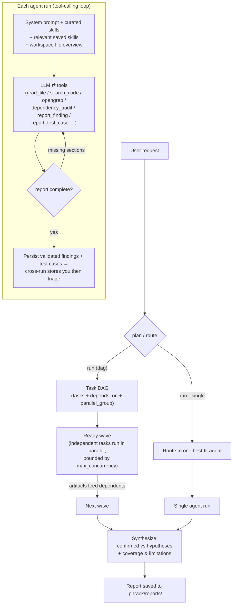

<!-- PHRAK Agent README -->

```
 ██████╗ ██╗  ██╗██████╗  █████╗ ██╗  ██╗
 ██╔══██╗██║  ██║██╔══██╗██╔══██╗██║ ██╔╝
 ██████╔╝███████║██████╔╝███████║█████╔╝
 ██╔═══╝ ██╔══██║██╔══██╗██╔══██║██╔═██╗
 ██║     ██║  ██║██║  ██║██║  ██║██║  ██╗
 ╚═╝     ╚═╝  ╚═╝╚═╝  ╚═╝╚═╝  ╚═╝╚═╝  ╚═╝
```

# PHRAK Agent — a whitebox penetration testing assistant

**PHRAK works a whitebox engagement from the source side, end to end: recon of
the codebase, threat modeling, code review, findings triage, a manual test plan,
and the final report.** It reads the application; it never touches one.

That boundary is the whole design. PHRAK has **no HTTP client, no proxy, no
scanner, and no exploit runner**. It sends **zero packets to any target** — not
in a scan, not in a "safe" probe, not to check whether a host is up. What it
produces is the artifact a whitebox tester needs: a prioritized set of findings
grounded in `file:line` evidence, and a test plan **you** execute against a
system you are authorised to test.

```
     source code                        PHRAK                        you
  ┌───────────────┐        ┌──────────────────────────────┐    ┌────────────┐
  │ repo / clone  │──read─▶│ recon · threat model · review │───▶│ triage     │
  │ dependencies  │        │ taint analysis · test plan    │    │ execute    │
  │ config        │        │ findings backlog · report     │    │ the tests  │
  └───────────────┘        └──────────────────────────────┘    └────────────┘
                                        ╳
                            never talks to the running app
```

**What that means in practice**

| PHRAK does | PHRAK does not |
|------------|----------------|
| Read source, config, and dependency manifests | Send a single request to a live target |
| Trace taint from source to sink (Opengrep) | Run an exploit against a deployed app |
| Model threats and attack paths against real components | Spider, fuzz, or scan a host |
| Keep a durable findings backlog you triage | Decide for you whether a bug is real |
| Author a manual test plan and track your progress | **Execute** those tests |
| Assemble the whole engagement into one report | Replace the human tester |

The one exception is opt-in and still never reaches your target: the
[`verify` agent](#the-verify-agent-opt-in) can run a minimal proof-of-concept
against **the code, inside a locked-down container with no network** — to check
whether a finding is actually exploitable. It is off by default.

Runs **fully offline on a local Ollama model** by default, or on **Claude via
the Anthropic API** if you opt in at setup. **PHRAK does not use Nuclei** (or
Semgrep/CodeQL/Joern — Opengrep is the sole static analyzer).

Everything a run produces stays on your machine, inside a per-workspace
`.phrack/` directory (like `.claude`).

## The workflow

A whitebox engagement, in the order you'd actually run it:

```bash
phrak clone https://github.com/org/app -w ./ws --index   # 1. bring the code in
phrak run "assess this app" -w ./ws                      # 2. model + review + tests
phrak findings -w ./ws                                   # 3. triage what came back
phrak testcases -w ./ws                                  # 4. work the test plan
phrak report -w ./ws                                     # 5. one deliverable
```

Steps 3 and 4 are yours, and **nothing in them involves a model**: you confirm or
dismiss findings, add ones you found yourself, and mark test cases off as you
execute them. Step 5 assembles everything into a single report.

## Agents

| Agent | Role |
|-------|------|
| `code_review` | Finds vulnerabilities in source (OWASP/CWE) with `file:line` findings, exploitability reasoning, and fixes. Uses **Opengrep in taint mode** (source→sink dataflow traces for SQLi, cmd-injection, path traversal, SSRF, deserialization) as its confirmed-lead source, **Opengrep pattern scan** + **secret scanning** as unconfirmed leads, then verifies each in source, and records validated structured findings. Also has **semantic `rag_search`** for finding sibling instances of a bug pattern. |
| `threat_model` | STRIDE/PASTA threat model: components, trust boundaries, data flows, per-threat table, and prioritized attack paths, tied to real components in the code. |
| `test_case` | Reads the source (and the `code_review` findings + `threat_model` threats fed forward) and turns them into a **prioritized list of concrete security test cases** — each with a target, steps, and an expected result — for you to work through manually. Each is recorded in a trackable [backlog](#test-cases). **PHRAK does not run the tests**; it produces the checklist. |
| `generate_report` | Assembles the whole engagement into one deliverable: executive summary, threat model, code review, findings, and every test case. Its body is **quoted verbatim** from the runs and stores that produced it — only the executive summary is model-written. See [The final report](#the-final-report-generate_report). |
| `verify` *(opt-in)* | Takes each confirmed data-flow finding and runs a minimal PoC **inside a locked-down container** to demonstrate exploitability: `--network none`, read-only rootfs, non-root, dropped caps, memory/pids capped, wall-clock timeout. When a PoC lands, the finding's runtime status is promoted. Off by default (`enable_verify: false`) — running attacker payloads is a policy decision. |

The **orchestrator** plans a dependency graph of agent tasks, runs independent
ones in parallel, feeds each task's findings forward, and synthesizes one
consolidated report (confirmed vs. hypotheses, with coverage & limitations).
`generate_report` is deliberately **not** schedulable by the planner — it is
invoked by hand, once the work it reports on exists.

## Install

```bash
python -m venv venv && source venv/bin/activate
pip install -e .                       # installs the `phrak` command
# then install Ollama (https://ollama.com) and pull a model:
ollama pull qwen2.5-coder:7b
```

(Or, without installing: `pip install -r requirements.txt` and use `python cli.py …`.)

Requires [Ollama](https://ollama.com) with a tool-capable model (default
`qwen2.5-coder:7b`) — unless you choose the Anthropic provider, which needs only
an API key. Optionally install [Opengrep](https://opengrep.dev) for
static-analysis leads (PHRAK degrades gracefully without it).

## Configure — `phrak config`

```bash
phrak config
```

An interactive wizard (**no AI involved**) asking for your default workspace,
model provider, model settings, and embeddings backend. It writes
`<workspace>/.phrack/config.yaml`.
Launching PHRAK with no config runs the wizard automatically; re-run mid-session
with `/config`. Inspect the resolved config any time with `phrak config --show`
(secret-looking values are redacted).

### Model provider — Ollama or Claude

The wizard's first choice is where the model runs:

| Provider | What it means |
|----------|---------------|
| `ollama` *(default)* | Fully local. Nothing leaves the machine. Asks for model, base URL, and temperature. |
| `anthropic` | Claude via the Anthropic API. Asks for the model (default `claude-opus-5`, or `claude-sonnet-5` / `claude-haiku-4-5`), a max-output-token cap, and your API key. **Prompts — including the code excerpts the agents read — are sent to Anthropic.** |

**The API key is stored in `<workspace>/.phrack/credentials`**, mode `0600` —
never in `config.yaml` (which `config --show` prints and the RAG indexer reads).
At startup PHRAK exports it as the process-wide `ANTHROPIC_API_KEY` environment
variable, which is where the SDK picks it up, so nothing else has to handle the
key. A key stored for the workspace **takes precedence** over one already
exported in your shell — it's this workspace's explicit configuration. If the
provider is `anthropic` and no key is found anywhere, PHRAK says so at startup
instead of failing on the first model call.

Re-run `phrak config` to rotate the key (press Enter at the prompt to keep the
stored one), or edit/delete `.phrack/credentials` directly. `.phrack/` is
already gitignored.

Per-agent overrides work across providers — e.g. a local model for
`code_review` and Claude for `threat_model`:

```yaml
agent_models:
  threat_model:
    provider: anthropic
    model: claude-opus-5
```

Embeddings for `/ask` are **always local** (Anthropic has no embeddings API);
with the `anthropic` provider, set `rag.embeddings.base_url` if your Ollama
server isn't at `http://localhost:11434`.

### The `.phrack/` directory

All per-workspace state lives in a single `.phrack/` dir at the workspace root:

```
<workspace>/.phrack/
├── config.yaml   # this workspace's configuration
├── credentials   # provider API keys (mode 0600) — only if you use one
├── rag/          # code-index vector store (Chroma)
├── skills/       # reusable skills you add from the CLI/REPL
├── findings/     # persistent finding history (cross-run dedup + triage)
├── testcases/    # the manual test-case backlog + your progress on it
├── taint/        # persistent taint-path history
├── reports/      # saved assessment reports
├── clones/       # repos brought in with `phrak clone`
├── scope.yaml    # optional declarative scope/target policy
└── history       # chat REPL history
```

`.phrack/` is git-ignored. Point at another project with `-w /path/to/project`
and it uses that project's own `.phrack/`. Anything added with `--global`
(skills) lives in your user-level `~/.phrack/` and applies to
every workspace. (Legacy top-level `config.yaml` + `data/` layouts are still
auto-detected.)

### Config keys

The wizard writes everything you normally need, but `config.yaml` is plain YAML
you can edit. See [`config.example.yaml`](config.example.yaml) for the fully
commented file; the knobs worth knowing:

| Key | Default | What it controls |
|-----|---------|------------------|
| `llm.provider` / `llm.model` | `ollama` / `qwen2.5-coder:7b` | Where the model runs and which one |
| `llm.num_ctx` / `llm.max_tokens` | `16384` / `16000` | Ollama context window / Anthropic output cap |
| `rag.*` | see example | Index location, `recall_k`, `chunk_lines`/`chunk_overlap`, `max_file_kb`, embeddings backend |
| `orchestrator.mode` | `dag` | `dag` (graph + parallel fan-out) or `linear` |
| `orchestrator.max_concurrency` | `3` | Bounded parallel agents per wave |
| `orchestrator.continue_on_failure` | `true` | Isolate a failed task instead of aborting the run |
| `analyzers.opengrep` / `analyzers.dependency_audit` | `true` | Turn either deterministic analyzer off |
| `max_steps` / `max_rounds` | `40` / `4` | Per-round tool-call budget / completion nudges |
| `keep_reports` | `50` | Prune to the newest N reports (`0` = keep all) |
| `enable_git_clone` | `false` | Expose the guarded `git_clone` **tool** to `code_review` (see [Safety posture](#safety-posture)) |
| `enable_verify` | `false` | Register the opt-in `verify` agent (runs PoCs in a container) |
| `verify_runtime` / `verify_image` | `auto` / `python:3.12-slim` | Container runtime (`auto` → docker, then podman) and PoC image |
| `verify_network` | `none` | PoC container networking — `none`, or `bridge` if you deliberately need it |
| `verify_timeout_s` / `verify_memory_mb` / `verify_pids` | `30` / `512` / `128` | Per-PoC wall clock, memory, and process caps |
| `agent_models` | `{}` | Per-agent overrides of any `llm:` field, across providers |

The `verify_*` keys only matter when `enable_verify: true`; see
[The `verify` agent](#the-verify-agent-opt-in).

## Quick start

```bash
phrak                              # conversational chat (like `claude`)
phrak -w /path/to/target           # chat about a specific codebase
phrak run "assess this app for security issues" -w ./target   # full swarm + report
phrak run --single "review server.py" -w ./target             # route to one agent
phrak clone https://github.com/org/webapp -w ./ws  # clone a repo into the workspace to analyze
phrak agent code_review "review for injection bugs" -w ./target
phrak ask "how are sessions authenticated?" -w ./target       # RAG over the code
phrak index -w ./target                # build/refresh the code index (no AI)
phrak index --stats -w ./target        # what's indexed, what's pending
phrak agents                           # list agents (and the model each uses)
phrak findings -w ./target             # every finding recorded so far
phrak findings --severity high --resurfaced -w ./target   # filter the backlog
phrak findings FND-284b4aac0d -w ./target                 # one finding in full
phrak add-finding -w ./target          # record one you verified yourself (no AI)
phrak testcases -w ./target            # the manual test plan, as a checklist
phrak add-testcase -w ./target         # write a test case by hand (no AI)
phrak report -w ./target               # assemble the whole engagement
phrak --json findings -w ./target      # the whole store as JSON, for CI
```

Global flags work on every subcommand: `-w/--workspace`, `-c/--config`,
`--quiet`, `--json`, `--no-color`, `--version`. (`phrak setup` is an
alias for `config`, `phrak interactive` for `chat`, and `-1` is short for
`run --single`.)

## Chat mode

Running `phrak` with no subcommand drops you into a conversational REPL: plain
text is a normal turn (PHRAK reads code and answers, keeping thread context), and
everything else is a slash command. `Tab` autocompletes them, `↑/↓` filters your
history by prefix, and unknown commands get a "did you mean" hint.

Anywhere in a message, `@path/to/file` inlines that file from the workspace into
the turn. Each reference is echoed back before the model runs (`attached
@app.py (1,204 B)`), so a typo'd path or a refused traversal is visible
immediately; files outside the workspace are never inlined.

| Command | What it does |
|---------|--------------|
| `/ask <text> [--reindex]` | Answer a question grounded in the codebase (RAG) |
| `/index [--rebuild\|--stats]` | Build or refresh the code index — no AI |
| `/run <text>` | Full multi-agent assessment + saved report |
| `/route <text>` | Auto-route to the single best-fit agent |
| `/code_review`, `/threat_model`, `/test_case` `<text>` | Run one agent directly |
| `/agents [--verbose]` | List agents (with `--verbose`, their tools too) |
| `/generate_report` | Assemble the whole engagement into one report |
| `/findings [filters]` | List recorded findings (see [Triage](#triage-findings)) |
| `/finding <id>` | One finding in full: evidence, taint paths, history, notes |
| `/finding-add` | Record a finding **you** verified — prompts, no AI |
| `/triage <id> <status> [note]` | Record your verdict on a finding |
| `/note <id> <text>` | Attach a reviewer note |
| `/testcases [filters]` | The test-case backlog as a checklist |
| `/testcase <id>` | One test case in full |
| `/testcase-add` | Write a test case by hand — prompts, no AI |
| `/testcase-status <id> <s>` | `new` / `in_progress` / `complete` (+ optional result) |
| `/testcase-link <id> <FND-…>` | Tie a test to the finding it verifies |
| `/testcase-note <id> <text>` | Record what happened when you ran it |
| `/clear` | Forget the conversation so far (fresh thread) |
| `/model [name]` | Show or switch the chat model for this session |
| `/cost` | Tokens used and estimated spend this session |
| `/verbose` | Toggle full tool output vs. one-line summaries |
| `/clone <url> [dest] [--index]` | Shallow-clone a repo to analyze |
| `/config [--show]` | Re-run the setup wizard (or print the redacted config) |
| `/help`, `/quit` | Grouped command list; exit |

Every `/run`, `/route`, and single-agent invocation saves and indexes its report
exactly like the equivalent CLI command.

## Triage findings

Agents write every finding into a durable, fingerprint-keyed store under
`.phrack/findings/` — so a finding keeps its identity across runs, and your
verdict on it survives the next scan. `/findings` and `phrak findings` are the
read/triage side of that store:

```bash
phrak findings                                  # the whole backlog, newest first
phrak findings --severity high --status new     # filter by severity / status
phrak findings --resurfaced                     # evidence changed since your verdict
phrak findings FND-284b4aac0d                   # full detail + status history + notes
phrak --json findings                           # machine-readable, for a CI gate
```

In chat, `/triage <id> <status> [note]` records a **human** verdict — one of
`new`, `confirmed`, `unconfirmed`, `false_positive`, `accepted_risk`, `fixed`.
Human triage is the authority of last resort: it can move a finding anywhere,
it's kept on a separate track from the agent's own status (so you can always see
both), and it is preserved when a later run re-observes the same finding.

If a re-run turns up materially stronger evidence for something you'd dismissed
— confidence jumped, severity changed, or a supporting taint path newly appeared
— the record is flagged **⟲ re-surfaced** for another look. `--resurfaced`
lists exactly those, and your next `/triage` clears the flag.

An `<id>` can be the full finding id, its fingerprint, or a unique prefix of
either.

### Findings you found yourself

Not every finding comes from an agent. `/finding-add` (or `phrak add-finding`)
records one you verified by hand — **no model is involved at any point**, the
fields are exactly what you typed, and the id is generated for you:

```
phrak➜ /finding-add

  new verified finding (Ctrl-C to cancel; the id is generated)
  Title: Auth bypass on /admin
  Category (e.g. SQL injection, broken access control): broken access control
  Severity [critical/high/medium/low/info]: critical
  File (workspace-relative): app/views.py
  Line: 88
  ...
[phrak] Recorded FND-9c41ba22e0 — critical, status confirmed (human).
```

Or non-interactively, for scripting:

```bash
phrak add-finding --title "Auth bypass on /admin" --category "broken access control" \
  --severity critical --file app/views.py --line 88 --cwe CWE-862
```

It lands on the **human** track as `confirmed`, which means it outranks anything
an agent later says about the same code and survives every re-run. The id is
derived from the finding's own content (category + location + title), so if an
agent independently reports the same issue the two converge onto **one** record
rather than duplicating — and your verdict is the one that sticks.

If the path doesn't resolve in the workspace you get a warning, not a
downgrade: you verified it, so PHRAK doesn't second-guess the verdict.

## Test cases

The `test_case` agent authors a manual test plan; the backlog is where **you**
work it. Every test case is a tracked item with a generated `TC-…` id, a status,
an optional result, notes, and a link to the finding it verifies.

```bash
phrak testcases                        # the checklist
phrak testcases --status in_progress   # what you're mid-way through
phrak testcases --finding FND-9c41ba22e0   # tests covering one finding
phrak testcases --unlinked             # tests not tied to any finding
phrak testcases TC-4751bf44            # one test case in full
phrak --json testcases                 # for a tracker import
```

```
3 test case(s) — 1 complete, 1 in progress, 1 new:
☑ TC-4751bf44  [critical] complete     [fail]     SQLi via uid            verifies FND-c3deed9c78
◐ TC-a1b2c3d4  [high    ] in_progress             Auth bypass on /admin   verifies FND-9c41ba22e0
☐ TC-9f8e7d6c  [medium  ] new                     Rate limit on /login    verifies —
```

Working the list, in chat:

```
/testcase-status TC-4751bf44 in_progress
/testcase-status TC-4751bf44 complete fail     # 'fail' = the app was vulnerable
/testcase-note   TC-4751bf44 reproduced with a single quote in uid
/testcase-link   TC-9f8e7d6c FND-9c41ba22e0    # tie it to the finding it verifies
```

Statuses are `new`, `in_progress`, `complete` (`done`, `wip`, `in-progress` and
friends are accepted). Results are `pass`, `fail`, `blocked`, `inconclusive` —
**`fail` means the test found the app vulnerable**, which is the outcome you
usually want recorded. `/testcase-link` refuses an id that doesn't exist, so a
typo surfaces immediately instead of at report time.

**Add your own** with `/testcase-add` (or `phrak add-testcase`) — again, no
model involved:

```bash
phrak add-testcase --title "Rate limit on /login" --target "POST /login" \
  --steps "send 100 requests in 10s | observe throttling" \
  --expected "requests are rejected after N" --severity medium
```

**Re-running `test_case` never costs you progress.** A re-authored test keeps
its status, result, notes and finding link — only the instructions (steps,
target, severity) are refreshed. The identity is derived from title + target, so
the same test written twice collapses into one backlog entry.

## The final report (`generate_report`)

`phrak report` (or `/generate_report`) assembles one deliverable:

| Section | Where it comes from |
|---------|---------------------|
| 1. Executive Summary | **Written by the model** — the only generated prose |
| 2. Threat Model | The latest `threat_model` report, quoted verbatim |
| 3. Code Review | The latest `code_review` report, quoted verbatim |
| 4. Findings | Rendered from `.phrack/findings/`, severity-ordered |
| 5. Test Cases | Rendered from `.phrack/testcases/`, with your progress |

```bash
phrak report                              # render to the terminal
phrak report "pre-release audit"          # add a scope note to the header
phrak report --out ./assessment.md        # write it to a file
```

**Only the executive summary is generated.** Everything else is quoted or
rendered from artifacts that already exist, because a model asked to "summarize
the code review" will paraphrase — and a paraphrased finding drifts away from
the `file:line` evidence the report claims to rest on. The summary itself is
prompted with a digest of that same material and told not to invent anything.

The report is honest about gaps. If `threat_model` has never been run, the
section says so and names the command to fix it, rather than quietly omitting a
heading; and if the model is unreachable, the summary is replaced by a factual
stub while every assembled section survives intact.

`generate_report` is excluded from the orchestrator's planner, so `phrak run`
can never schedule it mid-assessment where it would report on findings that
hadn't been made yet.

## Bring in a codebase (`phrak clone`)

Analyze a remote repo without cloning it by hand — `phrak clone` (no AI) shallow-
clones it into a sandboxed area under the workspace and can index it in one step:

```bash
phrak clone https://github.com/org/webapp -w ./ws      # -> ./ws/clones/webapp
phrak clone git@github.com:org/webapp.git --index      # clone + build the RAG index
```

It clones `--depth 1 --single-branch` with **git hooks disabled** and submodules
skipped by default (`--recurse` to include them); **HTTPS/SSH URLs only** —
`file://`, local paths, and URLs carrying inline credentials are refused (so no
secret is ever written to a logged URL; use git's own SSH keys / credential
helper). The clone is size-capped and confined to `<workspace>/clones`. Cloned
code is treated like any other workspace target — the same read-only sandbox
applies.

## How orchestration works

`phrak run` plans a **DAG of agent tasks** and executes it with bounded parallel
fan-out: independent tasks run at the same time, dependent tasks wait for and
receive their prerequisites' output.



**Step by step:**
1. **Plan or route.** In `dag` mode (default) `phrak run` asks the LLM for a task
   graph — each task assigned to an agent, with `depends_on` and a
   `parallel_group` — and falls back to a linear DAG if planning fails.
   `orchestrator.mode: linear` keeps the classic ordered pipeline.
   `phrak run --single` routes to the single best-fit agent (LLM, then keyword
   heuristic) and skips synthesis.
2. **Execute the DAG.** The orchestrator runs each ready wave concurrently
   (bounded by `orchestrator.max_concurrency`, default 3). A failed task is
   **isolated**: its dependents are skipped, independent tasks keep running.
   Run-scoped state (findings, tool ledger) is context-isolated so parallel
   agents never clobber each other.
3. **Each agent** runs a tool-calling loop (bounded by `max_steps`) with its
   curated skills applied (front-loaded for `code_review`, or exposed as an
   on-demand index for the skill-heavy `threat_model` / `test_case`), the most
   relevant saved skills
   injected, and a real file overview of the workspace. If the report is missing
   required sections it's nudged to continue (up to `max_rounds`); if it stalls
   asking you to paste code, PHRAK reads the files itself. Progress is streamed to
   the terminal (see [Live activity output](#live-activity-output)).
4. **Findings feed forward** to dependent tasks (e.g. `code_review` +
   `threat_model` → `test_case`) and are **persisted** to the cross-run history
   store.
5. **Synthesis.** The orchestrator merges outputs into one report that
   **separates confirmed findings from hypotheses, preserves disagreement**
   between agents, and adds a coverage & limitations section (including any failed
   or skipped task), saved to `.phrack/reports/`.

### Surviving weaker local models

Small local models often *print* a tool call as JSON (or inside `<tool_call>`
tags) instead of emitting a structured one, which would otherwise make the agent
loop silently do nothing. `appsec/middleware.py` intercepts that: when a reply
carries no real tool calls but its content contains a well-formed call naming a
bound tool, it's converted into a genuine tool call and executed. This is why
PHRAK works on models like `qwen2.5-coder:7b` without per-agent workarounds. It
is enabled only for non-Anthropic providers — Claude emits real tool calls.

**This is also a prompt-injection surface**, and it's treated as one. A security
agent reads hostile input by definition: the file under review, a quoted user
message, an "example payload" the model is warning you about. Any of those can
be echoed back into the reply as JSON that *looks* like a call. So the extractor
narrows what counts as genuine intent to call a tool:

1. **Fenced blocks or `<tool_call>` tags only.** Raw JSON in prose is ignored —
   the earlier bare-content fallback was removed.
2. **Example-framing is skipped.** If the prose around the fence (± ~120 chars)
   frames it as illustrative — "for example", "e.g.", "such as", "do not run" —
   no call is made.
3. **Inline `` `code spans` `` and blockquoted (`> …`) lines never trigger a
   call** — the two ways quoted-from-elsewhere content usually arrives.

It stays a *compensating control for weak models*, not a security boundary: the
real boundaries are the read-only tool set and the workspace sandbox.
`tests/test_middleware_injection.py` pins each rule.

## Static analyzer: Opengrep

`code_review` runs **Opengrep** as its deterministic lead source, then verifies
every hit by reading the code:

- **`opengrep_taint_scan`** — Opengrep in **taint mode** with PHRAK's own bundled
  ruleset (`appsec/analyzers/rules/taint/`), tracing source→sink dataflow rather
  than matching a pattern in isolation. These are the **confirmed leads**: a hit
  carries an actual path from untrusted input to a dangerous sink.
- **`opengrep_scan`** — fast pattern-based rules across many languages
  (`--config auto` by default). Returns `file:line [severity] rule -> message`.
  Pattern hits are **unconfirmed leads** to verify in source.
- **`scan_secrets`** — Opengrep's secrets ruleset, for hardcoded credentials/keys.

[Opengrep](https://opengrep.dev) is the open-source (LGPL) fork of Semgrep OSS:
the same `scan` subcommand and JSON output, but with no telemetry and no login.

**Bundled taint-rule coverage is deliberately narrow** — hand-written rules that
hold up, not breadth:

| Language | Rules |
|----------|-------|
| Python | SQL injection, command injection, path traversal, SSRF, unsafe deserialization |
| JavaScript / TypeScript | SQL injection, command injection, SSRF |

Anything outside that table gets no taint trace — `opengrep_scan`'s pattern
rules and the agent's own source reading are the fallback, and both produce
`unconfirmed` findings. Since a data-flow finding **cannot be marked `confirmed`
without a supporting taint path**, a SQLi in Ruby or Java will surface as a lead
and stay one. Point `--config` at your own rules to extend this.

Opengrep is PHRAK's **sole** static analyzer — the earlier Semgrep/CodeQL/Joern
setup (and the bespoke Python taint engine before it) has been removed. The tool
is **optional and degrades gracefully**: if the binary isn't on PATH it returns an
install hint instead of failing the run. Findings are **leads**, not confirmed
vulnerabilities — the agent confirms each by reading the surrounding code.

### Installing Opengrep

```bash
# Linux/macOS — official installer puts `opengrep` on PATH:
curl -fsSL https://raw.githubusercontent.com/opengrep/opengrep/main/install.sh | bash
opengrep --version
```

PHRAK resolves the binary from `$PHRAK_OPENGREP_BIN` if set, otherwise `opengrep`
on PATH. Rules come from `--config`: `auto` (default), a registry id
(e.g. `p/owasp-top-ten`), or a **path to a local rules file/directory** — point at
a local ruleset for fully-offline scans.

### Normalized findings, dependency audit & false-sanitizer checks

Analyzer output isn't left as opaque text. Each analyzer is an **`AnalyzerAdapter`**
(`appsec/analyzers/`) that normalizes its results into the same structured
`SecurityFinding` objects an agent reports by hand, so they run through one
`validate → ground → dedupe` pipeline and render together:

- **`analyzer_scan`** — runs Opengrep and records each hit as a workspace-grounded,
  `unconfirmed` finding (a lead to verify), deduped with anything you later confirm.
- **`dependency_audit`** — audits dependency manifests for **known-vulnerable
  versions** via `pip-audit` / `npm audit` / `govulncheck` / `cargo audit` (per
  ecosystem, each optional), each normalized into a `vulnerable-dependency` finding
  with advisory id, severity, CWE, and fix version. (This is deeper than
  `analyze_dependencies`, which only dumps manifests.)
- **`check_sanitizer`** — a context-sensitive effectiveness table so the reviewer
  doesn't dismiss a bug on a **false-sanitizer assumption**: HTML-escape ≠ SQL-safe,
  `urlparse` ≠ SSRF-safe, `shlex.quote` is fragile with `shell=True`, a prefix check
  *before* canonicalization is bypassable, and authentication ≠ authorization.

## The `verify` agent (opt-in)

Every other agent is static and read-only. `verify` is the one that **executes
attacker input**, so it is off by default and has to be turned on deliberately:

```yaml
enable_verify: true          # .phrack/config.yaml
```

It only appears in the agent registry when that flag is set — otherwise the DAG
planner can't schedule it, so a plain "assess this app" run can never pull it in
by accident. It needs `docker` or `podman` on PATH; without one, `run_poc`
returns an install hint instead of falling back to the host.

**What it does.** It runs after `code_review`/`threat_model` and takes their
**confirmed data-flow findings** — SQLi, command injection, path traversal,
unsafe deserialization, SSRF against a controlled target — writes a short PoC
for each, and runs it in a container. It may only confirm findings already in
the run's ledger; discovery is not its job. A PoC that lands is recorded as
`evidence_type=runtime_observation`, promoting the finding on the **runtime**
status track; one that doesn't land after a retry is recorded
`runtime_status: false_positive` with a note on what was tried — it is never
re-marked confirmed. Bugs needing a full app stack are reported as
*out of scope* rather than guessed at.

**The sandbox.** Every PoC runs via `docker run --rm` (or podman) with:

| Flag | Effect |
|------|--------|
| `--network none` | No network at all (`verify_network`; `bridge` only if you set it) |
| `--read-only` + `--tmpfs /tmp` | Immutable rootfs; scratch space is 64 MB of tmpfs |
| `--user 65534:65534` | Runs as `nobody`, never root |
| `--cap-drop ALL`, `--security-opt no-new-privileges` | No capabilities, no privilege escalation |
| `--memory`, `--pids-limit` | Memory and process caps (`verify_memory_mb`, `verify_pids`) |
| `-v <workspace>:/workspace:ro` | Workspace mounted **read-only**, and only when the PoC asks for it |
| wall-clock kill | Hard timeout (`verify_timeout_s`, default 30s) |

**This is a real trade-off, not a solved problem.** You are running
model-authored attacker code. The sandbox is a strong boundary, not a proof —
container escapes exist. Leave `verify` off unless you want that trade, and
run it against code you're authorised to test.

## Authoring the test plan (`test_case`)

`test_case` runs last in a full assessment. It reads the source together with the
findings fed forward from `code_review` and the threats from `threat_model`, and
turns them into a **prioritized list of concrete security test cases** for you to
work through by hand. Each is written in a standard, reviewable shape — a title,
the finding/threat it verifies, the exact target (endpoint / parameter /
`file:line`), preconditions, numbered steps with a real payload, and the
**expected result** that proves the issue present-or-absent — and the set is
ordered by risk with a traceability table back to each finding/threat.

Every test case is also recorded via `report_test_case` into the trackable
[backlog](#test-cases), with a generated `TC-…` id, so the plan is something you
work through and check off rather than a wall of prose in a report.

Its curated skills cover deriving test cases from findings and threats, the
standard test-case shape, abuse-case enumeration beyond the confirmed findings,
and risk-based prioritization.

**A checklist, not an executor — PHRAK never runs the tests.** The agent is
read-only (no HTTP or script-execution tool) and sends **no traffic to any
target**. It hands you the plan to run yourself in your own authorised
environment. A test case is a hypothesis until *you* execute it; the backlog's
`result` field is where that outcome gets recorded.

## Structured findings model

`appsec/models/findings.py` provides a typed `SecurityFinding` (with
`FindingEvidence` and `TaintPathReference`/`TaintNode`/`TaintStep`) used to
represent findings with evidence, CWE/OWASP tags, confidence, status, and
validated taint paths. It supports:
- **Stable fingerprints** so the same vuln is recognized across runs (history /
  dedup).
- **Validation** — confidence bounds, enums, workspace-grounded evidence (paths
  inside the workspace, valid line numbers, snippet ≈ source), and the rule that
  a data-flow finding cannot be `confirmed` without a supporting taint path.
- **Separate status tracks** — `agent` / `runtime` / `human`, folded into one
  `effective_status` with **human precedence** (human > runtime > agent), so who
  decided what stays auditable.
- **Serialization** + **Markdown rendering** + **deduplication**.

`report_finding` REJECTS structurally-invalid input and **downgrades** ungrounded
evidence to `unconfirmed` (it never silently upgrades a model claim).

## Findings history & scope

Findings and taint paths don't vanish when a run ends — they're persisted per
workspace so PHRAK can answer "is this new or known?" and keep triage decisions:

- **Persistent history** — every run upserts into `.phrack/findings/` and
  `.phrack/taint/` (JSONL), keyed by fingerprint, tracking first/last seen, a
  per-run log, status changes, and reviewer notes. A human verdict survives
  re-runs; a materially-changed re-observation is flagged `⟲ re-surfaced`.
- **Concurrency-safe** — the DAG runs agents in parallel and each persists at
  the end of its run, so every read-modify-write on the store is serialized (a
  thread lock plus an advisory file lock, the latter covering two `phrak`
  processes on one workspace) and every write lands via an atomic rename. No
  agent's findings can be dropped by another finishing at the same moment, and a
  crash mid-write can't truncate the store.
- **Triage tracks** — `runtime` and `human` verdicts are recorded separately from
  the reporting agent's claim, so a status change stays attributable to whoever
  made it. Browse and triage the store with `phrak findings` / `/findings`
  (see [Triage findings](#triage-findings)), or read
  `.phrack/findings/findings.jsonl` directly.

- **Scope policy** — an optional `<workspace>/.phrack/scope.yaml` makes "what am I
  allowed to touch" declarative: `allowed_hosts` / `allowed_ports` / path prefixes
  and a `rate_limit_per_min`. It can only **narrow** what's already permitted — the
  loopback-only floor is always enforced first and never weakened. See
  [`scope.example.yaml`](scope.example.yaml).

- **Public log** — `.phrack/` never leaves your machine, so real findings worth
  publishing get curated by hand into [`FINDINGS.md`](FINDINGS.md): what PHRAK
  found, in what, and what happened after disclosure (plus a *Not findings*
  table for leads that triage killed).

### Sample structured finding (Markdown render)

```
### SQL injection in /user  `FND-ab12cd34ef`

Severity: High
Confidence: 0.91
Status: Confirmed
CWE: CWE-89
OWASP: A03:2021-Injection

Source:
- app/routes.py:44 — request.args['id']

Sink:
- app/db.py:91 — cursor.execute(q)

Taint path:
1. app/routes.py:44 — assignment
2. app/db.py:91 — call

Sanitizers:
- None observed

Evidence:
- app/routes.py:40-48 — untrusted query parameter
- app/db.py:84-96 — string-formatted SQL passed to execute()
```

## Skills

- **Curated skills** ship under `appsec/skills/<agent>/*.md` and encode each
  specialist's baseline methodology (threat_model: architecture · data-flow ·
  PASTA · threat-details · executive-summary; code_review: OWASP A01–A10;
  test_case: deriving-test-cases · test-case-design · abuse-case-enumeration ·
  prioritization). `code_review` has every curated skill inlined into its prompt
  and applies them all; skill-heavy agents (`threat_model`, `test_case`) instead
  get a one-line skill index and pull each full procedure on demand via
  `load_skill`, keeping the prompt within the model's context window.
- **Saved skills** live under `.phrack/skills/*.md` (per-workspace) or
  `~/.phrak/skills/*.md` (global, applies to every workspace; a workspace entry
  overrides a global one of the same name). PHRAK does not auto-author skills —
  drop your own markdown files into either directory. The most relevant ones are
  surfaced into later prompts by lexical relevance.

## Usability & customization

Quality-of-life features for daily use (none affect the security posture):

- **Scripting:** `--quiet` / `--json` output (`run`, `findings`) for scripting.
- **Config & color:** `--no-color`; `phrak config --show` (redacted).
- **Discoverability:** grouped `/help`, `/agents --verbose` (agents + their
  tools), `--version`, `Tab` completion, typo "did you mean" hints.
- **Context:** `@path/to/file` attaches a workspace file to any chat message,
  echoing each reference (and why one was refused) before the model runs.
- **Triage:** `/findings`, `/finding`, `/triage`, `/note` work the cross-run
  finding store without leaving chat.
- **Session control:** `/clear` (fresh thread), `/model` (switch mid-session),
  `/cost` (tokens + estimated spend), `/verbose` (full tool output).
- **Run control:** clean Ctrl-C cancel; readline `↑/↓` filters your prompt
  history, persisted per workspace in `.phrack/history`.

## Codebase Q&A (`/ask`)

`phrak ask "<question>"` retrieves relevant chunks from a local Chroma index over
the workspace and answers with `path:start-end` citations. The index covers
source + docs and **also indexes the workspace's own `.phrack/` reports and
saved skills** (so you can ask "what did the last threat model flag?"); only
the vector store itself (`.phrack/rag/`) is skipped. Tune under `rag:` in config.

Every finished run writes its report to `.phrack/reports/` and folds it straight
into `.phrack/rag/` — a single-agent run (`phrak agent <name> …`, `/<name>` in
chat) saves `report-<ts>-<agent>.md`, and a pipeline run saves its consolidated
`report-<ts>.md`. Because the agent appends its **structured findings** (id,
severity, CWE, evidence `file:line`, disproof condition) to its own output, you
can ask about a vulnerability the moment the run ends rather than waiting for
`/ask` to sync. Both kinds share the `report-*.md` namespace, so
`keep_reports` prunes them together.

Chunking is line-window based (`rag.chunk_lines` / `rag.chunk_overlap`) and
retrieval is dense vector search over the local embeddings backend (`default`
local ONNX or `ollama`). Tune the chunk size, `recall_k`, included extensions,
and excluded dirs under `rag:` in config.

**Keeping the index current.** The index is refreshed before every question, so
a citation reflects the code as it is now, not as it was when first indexed. The
sync is **incremental**: files are keyed by mtime, so only what changed
re-embeds. Added files appear, edited files are re-chunked, deleted files drop
out, and an untouched workspace costs a stat walk.

If the embeddings backend is unreachable, the answer is still produced from
whatever is indexed — prefixed with an explicit staleness warning, never
silently.

### `phrak index` — do the embedding on your own schedule

Embedding is **local and CPU-bound**: a few hundred files takes minutes. That
cost has to be paid once, and `phrak index` is how you pay it deliberately
rather than discovering it mid-assessment.

```bash
phrak index                  # build or refresh — no AI, no model, no network
phrak index --stats          # what's indexed and what's pending; changes nothing
phrak index --rebuild        # wipe and re-embed everything (slow)
phrak --json index           # machine-readable, for CI
```

```
[phrak] index :: 4359 chunk(s) from 742 file(s) :: .phrack/rag
[phrak] workspace :: 742 indexable file(s)
[phrak] up to date — nothing to do
```

Run it after `phrak clone`, or after a big refactor, and every later `/ask` and
`rag_search` is instant. `/index` does the same thing inside a chat session.

**Timing matters more than it looks.** The agents' `rag_search` tool refreshes
the index at most **once per process**, serialized across the DAG's parallel
agents — they cannot each embed the workspace, and an agent that arrives while
one is indexing waits rather than duplicating the work. But that one refresh
still happens inside a tool call. On a large, never-indexed workspace that is a
multi-minute pause mid-run (with progress output, but still a pause). Indexing
up front avoids it.

Reach for `--rebuild` only when the index itself is suspect — a changed chunk
size or embeddings model, or a corrupted store. Ordinary edits are handled
incrementally.

## Live activity output

During any agent run PHRAK prints tool calls (`⚙ tool(args)` / `↳ tool: result`)
and each external syscall a tool makes (`⟫ exec: <command>` then `✓/✗ …`) tagged
with the running agent — so you can see if and when a subprocess or network call
happens. Between tool calls it also streams progress notes on the same channel:
`… <agent>: analyzing the workspace…`, a `✎` preview of the model's narration as
it writes, `… completion round N/M` while it fills in missing report sections,
`… recorded N structured finding(s)`, and `… compiling the final report` — so a
long run (e.g. `threat_model`) visibly shows activity instead of looking stuck.
Output stays clean when piped (no ANSI, no spinner artifacts).

## Safety posture

- **PHRAK never interacts with a running application.** There is no HTTP client,
  no proxy, no scanner, and no exploit runner anywhere in the tool. It cannot
  send a request to a target because nothing in it can send one.
- `code_review`, `threat_model`, `test_case`, and `generate_report` — the agents
  that run by default — are all **read-only**: they read source and write
  reports, and have **no HTTP or script-execution tool**.
- **`verify` is the one agent that executes code**, and it is **off by default**
  (`enable_verify: false`). When enabled, every PoC runs inside a container with
  no network, a read-only rootfs, no capabilities, as `nobody`, under memory /
  pid / wall-clock caps — never on the host. See
  [The `verify` agent](#the-verify-agent-opt-in) for the full trade-off.
- `test_case` produces a test *plan*, not an executor: it sends **no traffic to
  any target**. Running the test cases is your own manual step, in an environment
  you're authorised to test.
- `phrak clone` reaches only the git host you name, shallow, with hooks disabled.
- **No agent can reach the network unless you opt in.** There are exactly two
  opt-ins, both **off by default**:
  - `enable_git_clone: true` adds a guarded `git_clone` **tool** to `code_review`
    (to pull a dependency's source in-tree for reading), under the same
    guardrails as `phrak clone` — HTTPS/SSH only, shallow, hooks disabled,
    size-capped, confined to `<workspace>/clones`.
  - `enable_verify: true` plus `verify_network: bridge` would give a PoC
    container network access. The default is `none`, and leaving it there is
    strongly recommended — a PoC that needs the network is out of scope for
    this agent.
- **PHRAK stays local-first:** on the default `ollama` provider everything runs
  on your box, and every outbound path is explicit and configured — nothing
  leaves silently. Those paths are: `phrak clone` (and the opt-in `git_clone`
  tool), pointing the Ollama `base_url` at a remote endpoint, and **choosing the
  `anthropic` provider**,
  which sends prompts (with the code excerpts the agents read) to the Anthropic
  API. The provider is shown in the boot banner (`model anthropic:claude-opus-5`)
  so you can always see which one a run used.
- **API keys never enter the config or the index:** they live only in
  `.phrack/credentials` (mode `0600`, no indexed file extension), are redacted
  from `config --show`, and are passed to the SDK via an environment variable
  rather than embedded in prompts or reports.
- File tools are sandboxed to the workspace; subprocess calls (analyzers) never
  use `shell=True` with model input.
- Agents always pause for `ask_user` / `request_permission`; there is no mode
  that auto-answers or auto-grants on the human's behalf.
- **PHRAK never scans or attacks remote hosts. It does not use Nuclei.**

## Limitations (read these)

- **This is the source half of a whitebox engagement, not the whole engagement.**
  PHRAK never observes the running application, so anything that depends on
  deployment — reverse-proxy rules, WAF behaviour, runtime configuration,
  environment variables, infrastructure — is outside what it can see. A finding
  it reports as unreachable may be reachable in production, and vice versa.
- LLM output quality tracks the local model you choose; **LLM confidence is not a
  probability of exploitability.**
- RAG retrieval is **not** proof of reachability.
- **Taint coverage is Python and JS/TS only** (and not every bug class in
  either). Outside that, findings stay `unconfirmed` leads — absence of a taint
  path is absence of a *rule*, not evidence the code is safe.
- Test cases are **generated, not run** — PHRAK never executes them, so each is a
  hypothesis to verify until you work through it yourself against a system you're
  authorised to test.
- A `verify` PoC that doesn't land means **not demonstrated**, not "not
  vulnerable" — the PoC may simply be wrong, or the bug may need a full app
  stack.
- **Human review remains required.**

## Tests

```bash
pip install pytest
pytest                        # the whole bench
pytest tests/test_store.py    # one module
```

The bench is **offline by design** — no test reaches the network or a live
model. Providers are faked (`tests/conftest.py::FakeLLM`), external CLIs
(Opengrep, `pip-audit`, the container runtime) are mocked, and every fixture
writes into a `tmp_path` workspace, so nothing touches your real `.phrack/`.

An `integration` marker is registered in `pyproject.toml` for tests that need a
running Ollama or a live target; no test currently claims it, so
`pytest -m "not integration"` and a bare `pytest` run the same set.

## Roadmap

PHRAK was built incrementally on one architecture. All landed work:

- **Foundations** — local-first `.phrack/` layout, Ollama provider, live
  activity logging, curated + user-added skills.
- **Structured findings** — validated, workspace-grounded `SecurityFinding`
  model with stable fingerprints, taint-path references, and dedup.
- **Security test cases** — a read-only test-case agent that turns findings and
  threats into a prioritized, traceable manual test plan (no live testing / no
  target traffic).
- **Opengrep** as the sole static analyzer + analyzer→finding normalization,
  dependency audit (pip/npm/go/cargo), and a context-sensitive sanitizer table.
- **History & scope** — persistent cross-run finding/taint history with separate
  agent/runtime/human status tracks, and a declarative scope policy
  (`.phrack/scope.yaml`).
- **DAG orchestration** — dependency-graph planning with bounded parallel
  fan-out and partial-failure isolation, and a disagreement-preserving
  synthesizer.
- **Taint mode** — bundled Opengrep dataflow rules (Python, JS/TS) as the
  confirmed-lead source, gating `confirmed` status on a real source→sink path,
  plus semantic `rag_search` for finding sibling instances of a bug pattern.
- **Runtime verification** — the opt-in `verify` agent, proving exploitability
  with a minimal PoC inside a locked-down container and promoting the finding's
  runtime status only when it lands.
- **Injection-hardened tool rescue** — verbalized-call extraction narrowed to
  fenced blocks, with example-framing, inline code, and blockquotes excluded.
- **Operator workflow** — a non-agentic layer over the agents' output: hand-
  entered verified findings, a trackable test-case backlog (status, result,
  notes, finding links), and `generate_report` to assemble the engagement into
  one deliverable.
- **Usability & extensibility** — `--quiet`/`--json`/`--no-color`, grouped
  `/help`, `/agents --verbose`, no-AI `phrak clone`, `@file` attachment, and the
  `/findings` triage surface over the cross-run store.

## Project layout

```
appsec/
  cli.py            argparse entry point (`phrak`) + the chat REPL loop
  app.py            bootstrap: config -> llm, skills, rag, orchestrator, registry
  base_agent.py     agent loop + registry + run-to-completion + finding persistence
  orchestrator.py   planner/router + DAG execution (parallel fan-out) + synthesis
  chat.py           conversational session (multi-turn, tool use, thread memory)
  repl.py           chat REPL helpers (readline autocomplete/history, grouped /help)
  llm.py            chat-model factory (ollama | anthropic) + model registry
  middleware.py     rescues "verbalized" tool calls from weaker local models
  runtime.py        process/run-scoped context (config, active agent, findings,
                    tool ledger — context-vars, so parallel agents stay isolated)
  config.py         config + setup wizard + .phrack path resolution + config --show
  credentials.py    provider API keys (.phrack/credentials -> env var at startup)
  rag.py            workspace code index (Chroma) powering /ask
  store.py          persistent finding/taint history (.phrack/findings, .phrack/taint)
  scope.py          declarative scope/target policy (.phrack/scope.yaml)
  clone.py          guarded shallow git clone
  session_cmds.py   session-command helpers: findings triage (/findings, /triage,
                    /note), manual finding entry, @file expansion, tool listing
  skill_store.py    saved-skills store (workspace + ~/.phrak global)
  skill_library.py  curated skills (appsec/skills/<agent>/*.md)
  file_assist.py    workspace overview + read-files-on-demand
  banner.py         startup banner + ANSI styling (NO_COLOR / non-TTY aware)
  ui.py             spinners, live activity log, markdown render, agent prompts
  report.py         deterministic consolidated-report assembly (generate_report)
  testcase_cmds.py  non-agentic test-case backlog commands (list/status/link/add)
  models/           structured findings + taint models + test-case model
  agents/           code_review, threat_model, test_case, generate_report,
                    verify (opt-in)
  analyzers/        AnalyzerAdapter base + opengrep, dependencies, sanitizers
                    rules/taint/   bundled Opengrep taint rules (python, javascript)
  tools/            common (sandbox/subprocess/loopback+SSRF guard), filesystem,
                    analysis, opengrep_tools, analyzer_tools, findings_tool,
                    rag_tool (semantic search), testcase_tool, clone_tool,
                    verify_tool (sandboxed PoC runner), interaction, skills_tool
  skills/           curated skills: threat_model/*.md, code_review/*.md,
                    test_case/*.md
cli.py              thin shim so `python cli.py …` still works
tests/              pytest bench (unit + marker-gated integration)
```

## Security

- **Found a vulnerability in PHRAK itself?** See [`SECURITY.md`](SECURITY.md) —
  report it privately, don't open a public issue.
- **Findings PHRAK has produced** are logged in [`FINDINGS.md`](FINDINGS.md).

## Contributing

See [`CONTRIBUTING.md`](CONTRIBUTING.md) — dev setup, the `black` / `ruff` style
rules, the mandatory module-header docstring, and the architecture invariants a
PR must not break (read-only agents, no network without opt-in, Opengrep as the
sole static analyzer). False positives and missed findings belong in a normal
issue; vulnerabilities in PHRAK itself go to [`SECURITY.md`](SECURITY.md).

## License

MIT — see [`LICENSE`](LICENSE).
