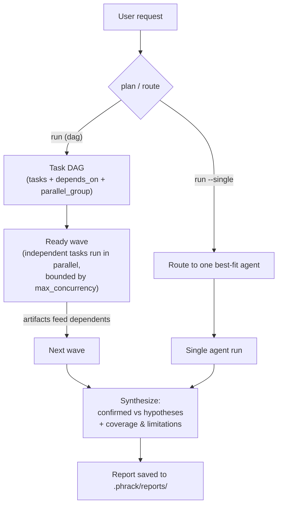

<!-- PHRAK Agent — orchestration -->

# How orchestration works

> Part of the [PHRAK Agent documentation](../README.md#documentation).

`phrak run` plans a **DAG of agent tasks** and executes it with bounded parallel
fan-out: independent tasks run at the same time, dependent tasks wait for and
receive their prerequisites' output.

1. **Plan or route.** In `dag` mode (default) `phrak run` asks the LLM for a task
   graph — each task assigned to an agent, with `depends_on` and a
   `parallel_group` — and falls back to a linear DAG if planning fails.
   `orchestrator.mode: linear` keeps the classic ordered pipeline. `run --single`
   routes to the single best-fit agent and skips synthesis.
2. **Execute the DAG.** Each ready wave runs concurrently (bounded by
   `max_concurrency`, default 3). A failed task is **isolated**: its dependents
   are skipped, independent tasks keep running. Run-scoped state is
   context-isolated so parallel agents never clobber each other.
3. **Each agent** runs a tool-calling loop (bounded by `max_steps`) with its
   curated skills, the most relevant saved skills injected, and a real file
   overview of the workspace. Missing report sections get a nudge to continue (up
   to `max_rounds`); if it stalls asking you to paste code, PHRAK reads the files
   itself. Progress is streamed (see [Live activity output](#live-activity-output)).
4. **Findings feed forward** to dependent tasks (e.g. `code_review` +
   `threat_model` → `test_case`) and are **persisted** to the cross-run history
   store. If the agents recorded nothing structured (a weak model that only wrote
   prose), the orchestrator salvages findings and test cases out of the report
   itself — see [Robustness on weak local models](#robustness-on-weak-local-models).
5. **Synthesis.** Outputs merge into one report that **separates confirmed
   findings from hypotheses, preserves disagreement** between agents, and adds a
   coverage & limitations section (including any failed or skipped task), saved to
   `.phrack/reports/`.
6. **Coverage reconciliation.** The orchestrator ties test cases to findings
   (`appsec/coverage.py`): each test case is linked to the finding it clearly
   verifies (unambiguous title-token overlap only), and every finding still
   without a linked test — including unconfirmed ones — gets a minimal
   verification test case. Idempotent, so a covered finding is never duplicated.

## Robustness on weak local models

Small local models often *print* a tool call (as JSON, or inside `<tool_call>`
tags) instead of emitting a structured one, and unreliably call the capture tools
even when they write a full report. PHRAK closes both gaps so it works on models
like `qwen2.5-coder:7b` without per-agent workarounds — all non-Anthropic-only
(Claude emits real tool calls):

- **Verbalized tool calls (`appsec/middleware.py`).** When a reply has no real
  tool calls but its content contains a well-formed call naming a bound tool, it's
  converted into a genuine call and executed. **This is also a prompt-injection
  surface** — a security agent reads hostile input by definition — so the
  extractor narrows what counts as intent: only fenced blocks / `<tool_call>` tags
  (raw JSON in prose is ignored), example-framing ("for example", "do not run") is
  skipped, and inline `` `code spans` `` / blockquoted lines never trigger a call.
  It stays a *compensating control for weak models*, not a security boundary — the
  real boundaries are the read-only tool set and the workspace sandbox.
  `tests/test_middleware_injection.py` pins each rule.
- **Guaranteed capture, three escalating layers.** Agents are prompted to record
  each item the moment they confirm it. If an agent finishes with a full report
  but an empty store, it gets one focused turn to transcribe the report into
  capture-tool calls. If the store is *still* empty, deterministic extraction
  (`appsec/extract.py`) parses the report text itself — no model, no tools — into
  the same validated objects, grounding each against the workspace (an item whose
  `file:line` can't be located is recorded `unconfirmed`). The orchestrator does
  the same salvage on the *consolidated* report, but only for a track the agents
  left empty this run. The extractor is conservative: only blocks carrying the
  attributes of a real finding/test case are recorded. `tests/test_extract.py`
  pins it against the shapes `qwen2.5-coder:7b` produces.

## Live activity output

During any agent run PHRAK prints tool calls (`⚙ tool(args)` / `↳ tool: result`)
and each external syscall (`⟫ exec: <command>` then `✓/✗ …`) tagged with the
running agent — so you can see if and when a subprocess or network call happens.
Between tool calls it streams progress notes: `… <agent>: analyzing the
workspace…`, a `✎` preview of the model's narration, `… completion round N/M`,
`… recorded N structured finding(s)`, and `… compiling the final report`. When a
weak model writes a report but never calls the capture tools, you'll see the
reliability layers kick in (`… transcribing the report into trackable items`,
`… recovered N finding(s) from the report text`). Output stays clean when piped
(no ANSI, no spinner artifacts).
